# Práctico ADA — Portal Vial IMSJ: justificación de clases, atributos y métodos

### Ingeniería de Software | Análisis y Diseño de Aplicaciones

> Este documento aplica al proyecto **Portal Vial IMSJ** el método de derivación usado en
> [`Practicos/ada-tambotrace.md`](https://github.com/portalutu/ing_software-3ro-bt/blob/main/Practicos/ada-tambotrace.md):
> sustantivos del dominio → clases; datos expresamente requeridos → atributos; verbos de los RF y las
> historias de usuario → métodos. El objetivo es justificar el modelo existente a partir de fuentes
> trazables, no inventar funcionalidades.

---

## 1. Alcance y criterio de precedencia documental

El repositorio contiene dos líneas de alcance y dos numeraciones de requerimientos que se superponen. Para
evitar referencias ambiguas se utiliza la siguiente convención:

| Prefijo | Fuente | Uso en este documento |
|---|---|---|
| `DOC-RFx` / `DOC-RNFx` | [`documentacion_proyecto_imsj.md`](./documentacion_proyecto_imsj.md) | Línea base posterior a la entrevista para los módulos entregables a la IMSJ. |
| `REQ-RFx` / `REQ-RNFx` | [`Requerimientos.md`](./Requerimientos.md) | Requerimientos de la agenda incluidos únicamente en la versión académica. |
| `USx` | [`backlog.md`](./backlog.md) | Historias de usuario. Se conserva la numeración existente; no se la renombra como HU porque el proyecto usa `US`. |
| `ENT` | [`informe entrevista.md`](./informe%20entrevista.md) | Decisiones y restricciones confirmadas por el cliente. |
| `ARQ` | [`arquitectura_propuesta.md`](./arquitectura_propuesta.md) | Responsabilidades del backend, persistencia, archivos y operación atómica de cupos. |
| `SEG` | [`analisis_ciberseguridad.md`](./analisis_ciberseguridad.md) | Hash de contraseñas, autorización, validación, auditoría y archivos seguros. |

Decisiones de alcance aplicadas:

1. Noticias, materiales de estudio, preguntas frecuentes, autenticación y auditoría pertenecen a la
   entrega acordada con la IMSJ (`DOC-RF1` a `DOC-RF13`).
2. Franjas y reservas se modelan porque integran la **versión académica**, pero se marcan como tales. La
   entrevista confirma que la agenda continúa siendo telefónica para el cliente (`ENT`, “Agenda de
   trámites”), mientras que el Project Charter y `ARQ` conservan el módulo para el curso.
3. Cuando una pregunta de relevamiento quedó sin respuesta —por ejemplo, los datos obligatorios del
   ciudadano o el costo de la renovación urgente— no se agregan campos por suposición.
4. La implementación visual existente puede corroborar el vocabulario del dominio, pero no reemplaza un
   RF, RNF, US o decisión de entrevista como origen de un elemento del modelo.

---

## 2. Metodología de derivación

| Paso | Técnica aplicada | Resultado |
|---|---|---|
| 1 | Sustantivos relevantes de RF, RNF, US y entrevista → candidatos a clase | `UsuarioAdministrativo`, `Noticia`, `MaterialEstudio`, `PreguntaFrecuente`, `CategoriaPregunta`, `HistorialAccion`, `FranjaDisponibilidad`, `Reserva`. |
| 2 | Datos mencionados para cada sustantivo → atributos | Ej.: `DOC-RF6` y `ENT` exigen inicio y fin de vigencia para `Noticia`; `DOC-RF7` exige portada, galería, texto y enlaces. |
| 3 | Verbos de acción → métodos | Ej.: `DOC-RF13` “requerir aprobación” → `Noticia.aprobar()`; `REQ-RF14` a `REQ-RF16` “visualizar” → métodos de `ConsultaAgenda`. |
| 4 | Restricciones que combinan datos y acciones → métodos de validación | Ej.: vigencia automática (`DOC-RNF7`) → `estaVigente()`; prevención de doble reserva (`REQ-RNF8`) → `hayCupo()` y `reservarCupo()` atómico. |

Este criterio cumple la trazabilidad exigida por el práctico de referencia: ningún elemento se acepta sin
un origen documental identificable.

---

## 3. Tabla de trazabilidad general

| Clase / tipo | RF de origen | RNF relacionados | US de origen | Épica |
|---|---|---|---|---|
| `UsuarioAdministrativo` / `TipoUsuarioAdministrativo` | `DOC-RF1`, `DOC-RF13` | `DOC-RNF1`, `DOC-RNF3`, `DOC-RNF4` | `US1`, `US2`, `US25`, `US26` | EP1, EP5 |
| `Noticia` / `EstadoPublicacion` | `DOC-RF2`, `DOC-RF5` a `DOC-RF8`, `DOC-RF13` | `DOC-RNF2`, `DOC-RNF7`, `DOC-RNF8` | `US3` a `US9` | EP2 |
| `MaterialEstudio` / `TipoMaterial` | `DOC-RF3`, `DOC-RF9`, `DOC-RF12` | `DOC-RNF2` | `US21`, `US22` | EP3 |
| `PreguntaFrecuente` / `CategoriaPregunta` | `DOC-RF4`, `DOC-RF10`, `DOC-RF11` | `DOC-RNF2`, `DOC-RNF8` | `US23`, `US24` | EP4 |
| `HistorialAccion` | — | `DOC-RNF3`, `DOC-RNF4` | `US25`, `US26` | EP5 |
| `PortalPublico` (servicio, sin persistencia propia) | `DOC-RF2` a `DOC-RF4` | `DOC-RNF5` a `DOC-RNF8` | `US3`, `US21`, `US23` | EP2, EP3, EP4 |
| `FranjaDisponibilidad` / `TipoTramite` **[académico]** | `REQ-RF11` a `REQ-RF13` | `REQ-RNF2`, `REQ-RNF8` | `US15` a `US17` | EP4 del backlog |
| `Reserva` **[académico]** | `REQ-RF3`, `REQ-RF4` | `REQ-RNF4`, `REQ-RNF8`, `REQ-RNF9` | `US10` a `US14` | EP3 del backlog |
| `ConsultaAgenda` (servicio, sin persistencia propia) **[académico]** | `REQ-RF14` a `REQ-RF16` | — | `US18` a `US20` | EP4 del backlog |

> **Nota sobre las épicas:** `documentacion_proyecto_imsj.md` redefine EP1–EP5 después de la entrevista,
> mientras que `backlog.md` conserva EP1–EP7 y la agenda. Por eso las filas académicas indican
> expresamente “del backlog”.

---

## 4. Diagrama de clases de referencia

El diagrama se incluye para que los elementos justificados en la sección 5 tengan una definición única.
Las relaciones y multiplicidades requieren una justificación propia y no forman parte del alcance de este
documento.

```mermaid
classDiagram
    class TipoUsuarioAdministrativo {
        <<enumeration>>
        PERSONAL_IMSJ
        DIRECCION
    }

    class UsuarioAdministrativo {
        -id: int
        -cedula: String
        -passwordHash: String
        -tipo: TipoUsuarioAdministrativo
        +iniciarSesion(cedula: String, password: String): boolean
        +puedeAprobarNoticias(): boolean
    }

    class EstadoPublicacion {
        <<enumeration>>
        NO_PUBLICADA
        PUBLICADA
    }

    class Noticia {
        -id: int
        -titulo: String
        -texto: String
        -fechaInicioVigencia: Date
        -fechaFinVigencia: Date
        -imagenPortada: String
        -galeriaImagenes: List~String~
        -enlacesUtiles: List~String~
        -estado: EstadoPublicacion
        -aprobadaPorDireccion: boolean
        +crear(): Noticia
        +actualizar(): void
        +eliminar(): void
        +aprobar(usuario: UsuarioAdministrativo): void
        +publicar(): void
        +despublicar(): void
        +estaVigente(fecha: Date): boolean
        +esVisible(fecha: Date): boolean
    }

    class TipoMaterial {
        <<enumeration>>
        PDF
        IMAGEN
        VIDEO
    }

    class MaterialEstudio {
        -id: int
        -nombre: String
        -tipo: TipoMaterial
        -ubicacionRecurso: String
        +registrar(): MaterialEstudio
        +actualizar(): void
        +eliminar(): void
        +esFormatoPermitido(): boolean
    }

    class CategoriaPregunta {
        -id: int
        -nombre: String
    }

    class PreguntaFrecuente {
        -id: int
        -pregunta: String
        -respuesta: String
        -visible: boolean
        +crear(): PreguntaFrecuente
        +actualizar(): void
        +eliminar(): void
        +clasificar(categoria: CategoriaPregunta): void
        +cambiarVisibilidad(visible: boolean): void
    }

    class HistorialAccion {
        -id: int
        -accion: String
        -fechaHora: DateTime
        -tipoElemento: String
        -elementoId: int
        +registrar(usuario: UsuarioAdministrativo, accion: String, elemento): void
    }

    class PortalPublico {
        <<service>>
        +consultarNoticias(fecha: Date): List~Noticia~
        +consultarMateriales(): List~MaterialEstudio~
        +consultarPreguntas(categoria: CategoriaPregunta): List~PreguntaFrecuente~
    }

    class TipoTramite {
        <<enumeration>>
        PRUEBA_MANEJO
        RENOVACION_NORMAL
        RENOVACION_URGENTE
    }

    class FranjaDisponibilidad {
        <<academic>>
        -id: int
        -fecha: Date
        -horaInicio: Time
        -horaFin: Time
        -tipo: TipoTramite
        -cuposTotales: int
        +crear(): FranjaDisponibilidad
        +actualizar(): void
        +eliminar(): void
        +hayCupo(): boolean
        +reservarCupo(): void
    }

    class Reserva {
        <<academic>>
        -id: int
        -datosSolicitante: DatosPersonales
        +crearEn(franja: FranjaDisponibilidad, datosSolicitante): Reserva
        +generarConfirmacion(): ConfirmacionReserva
    }

    class ConsultaAgenda {
        <<service, academic>>
        +listarPorDia(fecha: Date): List~Reserva~
        +listarPorSemana(fecha: Date): List~Reserva~
        +listarPorMes(fecha: Date): List~Reserva~
    }

    UsuarioAdministrativo "1" --> "1" TipoUsuarioAdministrativo : tiene
    UsuarioAdministrativo "1" --> "0..*" HistorialAccion : genera
    Noticia "1" --> "1" EstadoPublicacion : tiene
    MaterialEstudio "1" --> "1" TipoMaterial : tiene
    CategoriaPregunta "1" --> "0..*" PreguntaFrecuente : clasifica
    FranjaDisponibilidad "1" --> "1" TipoTramite : corresponde a
    FranjaDisponibilidad "1" *-- "0..*" Reserva : recibe
    PortalPublico ..> Noticia : consulta
    PortalPublico ..> MaterialEstudio : consulta
    PortalPublico ..> PreguntaFrecuente : consulta
    ConsultaAgenda ..> Reserva : consulta
```

---

## 5. Justificación de clases, atributos y métodos

### 5.1 `UsuarioAdministrativo` / `TipoUsuarioAdministrativo`

| Elemento | Justificación y origen |
|---|---|
| Clase `UsuarioAdministrativo` | `DOC-RF1` exige iniciar sesión con cédula y contraseña; `DOC-RNF1` separa al público general del personal IMSJ. No se crea una clase `Ciudadano` para la consulta pública porque los documentos no exigen registro ni autenticación del público. |
| `id` | La base de datos debe persistir usuarios (`ARQ`, sección 3) y `DOC-RNF3` exige vincular cada acción administrativa con el usuario responsable. Un identificador estable permite conservar esa referencia aunque cambien otros datos. |
| `cedula` | Dato de acceso indicado literalmente por `DOC-RF1` y `US1`. También queda sujeto a protección por `DOC-RNF4`. |
| `passwordHash` | `DOC-RF1` requiere contraseña, pero `SEG`, sección 3, dispone que no se almacene en texto plano y propone `bcrypt`; por eso el atributo representa el hash y no la contraseña original. |
| `tipo: TipoUsuarioAdministrativo` | `ENT` aclara que el personal administrativo no tiene subniveles generales de permiso, pero `DOC-RF13` exige que la **Dirección** apruebe las noticias. Los valores `PERSONAL_IMSJ` y `DIRECCION` modelan únicamente esa excepción de aprobación; no introducen jerarquías administrativas adicionales. |
| `iniciarSesion()` | Deriva directamente del verbo de `DOC-RF1` y de `US1`. La comparación se realiza contra `passwordHash`, de acuerdo con `SEG`. |
| `puedeAprobarNoticias()` | Hace verificable la restricción de `DOC-RF13`: solo un usuario que represente a la Dirección puede aprobar una noticia. No otorga permisos diferentes para las demás operaciones, respetando `ENT`. |

### 5.2 `Noticia` / `EstadoPublicacion`

| Elemento | Justificación y origen |
|---|---|
| Clase `Noticia` | `DOC-RF2` exige la consulta ciudadana y `DOC-RF5` la publicación y administración por el personal IMSJ; `US3` y `US4` expresan ambas perspectivas. |
| `id` | `DOC-RF5` exige administrar noticias y `DOC-RNF3` auditar el elemento afectado. Se necesita una identidad estable para editar una noticia concreta y referenciarla desde `HistorialAccion`. |
| `titulo`, `texto` | `DOC-RF7` exige cargar texto. El título identifica cada noticia dentro de la administración y la consulta; ambos conforman el contenido textual que el sistema publica. No se agrega un campo `resumen` porque no figura en los requisitos formalizados. |
| `fechaInicioVigencia`, `fechaFinVigencia` | `DOC-RF6` exige definir un período de vigencia y `ENT` confirma expresamente que cada noticia tendrá fecha de inicio y fecha de finalización. |
| `imagenPortada`, `galeriaImagenes`, `enlacesUtiles` | Copiados de `DOC-RF7`: imagen de portada, galería de imágenes y enlaces útiles. Se usa una lista para galería y enlaces porque los términos “galería” y “enlaces” admiten más de un elemento. |
| `estado: EstadoPublicacion` (`NO_PUBLICADA`, `PUBLICADA`) | `DOC-RF8` enumera literalmente los estados publicada / no publicada; `DOC-RNF8` exige separar claramente ambos conjuntos. No se agregan otros estados no documentados. |
| `aprobadaPorDireccion` | `DOC-RF13` y `ENT` establecen una condición distinta del estado de publicación: la Dirección debe aprobar la noticia antes de que sea visible. Se representa por separado para no confundir “aprobada” con “publicada”. El usuario, la acción y la fecha de aprobación quedan registrados en `HistorialAccion` por `DOC-RNF3`. |
| `crear()`, `actualizar()`, `eliminar()` | Derivan de “publicar y administrar noticias” (`DOC-RF5`, `US4`). Son las operaciones mínimas de mantenimiento del contenido; cada una debe generar auditoría (`DOC-RNF3`). |
| `aprobar(usuario)` | Deriva de `DOC-RF13`. Recibe el usuario para comprobar `puedeAprobarNoticias()` y registrar la acción administrativa. |
| `publicar()`, `despublicar()` | Derivan de la gestión del estado exigida por `DOC-RF8` y `US7`. `publicar()` tiene como precondición `aprobadaPorDireccion = true`, según `DOC-RF13`. |
| `estaVigente(fecha)` | Implementa el manejo automático de vigencia de `DOC-RNF7` y `US8`, comprobando que la fecha se encuentre entre inicio y fin. |
| `esVisible(fecha)` | Centraliza la regla pública: una noticia solo se devuelve si está `PUBLICADA`, fue aprobada por Dirección y está vigente. Integra `DOC-RF2`, `DOC-RF8`, `DOC-RF13`, `DOC-RNF7` y `DOC-RNF8`. |

### 5.3 `MaterialEstudio` / `TipoMaterial`

| Elemento | Justificación y origen |
|---|---|
| Clase `MaterialEstudio` | `DOC-RF3` permite a la ciudadanía acceder a materiales y `DOC-RF9` permite administrarlos; corresponde a `US21` y `US22`. |
| `id` | La administración y la persistencia mencionadas en `DOC-RF9` y `ARQ` requieren distinguir cada recurso; además permite identificar el elemento afectado en la auditoría de `DOC-RNF3`. |
| `nombre` | Permite identificar el manual, normativa, ley o video que el ciudadano selecciona. Es el dato descriptivo mínimo derivado del conjunto de materiales descrito en `ENT`; no se agregan metadatos no solicitados, como autor, versión o tamaño. |
| `tipo: TipoMaterial` (`PDF`, `IMAGEN`, `VIDEO`) | Los tres valores provienen literalmente de `DOC-RF12` y de `ENT`. Se usa un enum cerrado para impedir formatos ajenos al alcance relevado. |
| `ubicacionRecurso` | `ARQ`, secciones 3 y 5, exige conservar y servir los archivos mediante el backend. El atributo representa la referencia segura al archivo o recurso almacenado, no el contenido binario dentro de la entidad. |
| `registrar()`, `actualizar()`, `eliminar()` | Derivan de “administrar materiales de estudio” (`DOC-RF9`, `US22`). Toda operación administrativa debe auditarse por `DOC-RNF3`. |
| `esFormatoPermitido()` | `DOC-RNF2` exige validar entradas; `SEG` exige aceptar solo los tipos previstos y verificar extensión y tipo real. El método valida contra `TipoMaterial`. |

### 5.4 `PreguntaFrecuente` / `CategoriaPregunta`

| Elemento | Justificación y origen |
|---|---|
| Clase `PreguntaFrecuente` | `DOC-RF4` exige la consulta pública y `DOC-RF10` la gestión administrativa; corresponde a `US23` y `US24`. |
| `pregunta`, `respuesta` | Son las dos partes necesarias del contenido “pregunta frecuente” que se consulta y mantiene en `DOC-RF4`/`DOC-RF10`. |
| `id` | Permite actualizar una pregunta concreta, relacionarla con una categoría y referenciar el elemento modificado en `HistorialAccion` (`DOC-RNF3`). |
| `visible` | `DOC-RNF8` exige separación clara entre contenido publicado y no publicado. Se utiliza un booleano porque los documentos no definen más estados para las preguntas frecuentes. |
| Clase `CategoriaPregunta` | `DOC-RF11` y `ENT` exigen clasificar las preguntas por categorías para facilitar la búsqueda. Se modela como clase y no como texto repetido para que varias preguntas compartan una categoría consistente. |
| `CategoriaPregunta.id`, `CategoriaPregunta.nombre` | El identificador permite la asociación estable; el nombre es el dato mínimo requerido para presentar y seleccionar la clasificación indicada por `DOC-RF11`. No se agregan descripción, orden ni jerarquía porque no fueron relevados. |
| `crear()`, `actualizar()`, `eliminar()` | Derivan de “gestionar la sección de preguntas frecuentes” (`DOC-RF10`, `US24`). Deben generar auditoría por `DOC-RNF3`. |
| `clasificar(categoria)` | Traduce el verbo “clasificar” de `DOC-RF11` y la decisión de `ENT`. |
| `cambiarVisibilidad()` | Hace operativa la separación entre contenido visible y no visible de `DOC-RNF8`; evita eliminar una pregunta únicamente para retirarla del portal público. |

### 5.5 `HistorialAccion`

| Elemento | Justificación y origen |
|---|---|
| Clase `HistorialAccion` | `DOC-RNF3` exige un historial completo de acciones administrativas; `US25` lo expresa como necesidad del personal. `ENT` confirma que debe saberse quién realizó cada modificación. |
| `id` | Identifica de forma estable cada registro de auditoría en la base de datos (`ARQ`). |
| Asociación con `UsuarioAdministrativo` | `ENT` exige conocer **quién** realizó el cambio y `SEG` incluye al usuario responsable entre los datos mínimos del registro. Se usa una asociación, no una copia de la cédula, para mantener una única identidad de usuario. |
| `accion` | `SEG` exige registrar la acción realizada. Debe distinguir, como mínimo, creación, modificación, publicación y eliminación. |
| `fechaHora` | `SEG` exige registrar fecha y hora de cada acción administrativa. |
| `tipoElemento`, `elementoId` | `SEG` exige registrar el elemento afectado. La pareja permite auditar de forma genérica noticias, materiales y preguntas sin crear una clase de historial diferente para cada entidad. |
| `registrar()` | Materializa `DOC-RNF3`. Recibe usuario, acción y elemento para producir una entrada completa. No se definen métodos normales de edición o eliminación porque `SEG` exige proteger el historial contra esas operaciones desde el dashboard. |

### 5.6 `PortalPublico` — clase de servicio sin persistencia propia

| Elemento | Justificación y origen |
|---|---|
| Clase `PortalPublico` | `DOC-RF2`, `DOC-RF3` y `DOC-RF4` describen operaciones de consulta que combinan reglas de visibilidad, pero no una entidad que deba persistirse. Siguiendo el criterio usado para `ReporteTrazabilidad` en el práctico de referencia, se modela como servicio con comportamiento y sin tabla propia. |
| Sin atributos persistentes | `ARQ` indica que el backend lee las entidades persistidas y las sirve al frontend público. No existe configuración propia del portal que los requisitos pidan almacenar. |
| `consultarNoticias(fecha)` | Resuelve `DOC-RF2` aplicando `Noticia.esVisible(fecha)`, de modo que no exponga noticias no aprobadas, no publicadas o vencidas (`DOC-RF13`, `DOC-RNF7`, `DOC-RNF8`). |
| `consultarMateriales()` | Resuelve el acceso ciudadano de `DOC-RF3` y `US21`. |
| `consultarPreguntas(categoria)` | Resuelve `DOC-RF4` y utiliza la categorización solicitada por `DOC-RF11` y `ENT`. |

### 5.7 `FranjaDisponibilidad` / `TipoTramite` **[versión académica]**

| Elemento | Justificación y origen |
|---|---|
| Clase `FranjaDisponibilidad` | `REQ-RF11`, `REQ-RF12` y `REQ-RF13` exigen cargar franjas para trámites normales, urgentes y pruebas de manejo. `ARQ` confirma que la versión académica persiste franjas y reservas. |
| `id` | Permite identificar una franja al reservarla, editarla y auditarla; la base de datos académica debe persistirla (`ARQ`). |
| `fecha`, `horaInicio`, `horaFin` | El backlog denomina a estas entidades “franjas horarias” (`US15` a `US17`) y `REQ-RF14` a `REQ-RF16` exige ubicarlas por día, semana y mes. Fecha e intervalo horario son los datos mínimos para satisfacer ambas necesidades. |
| `tipo: TipoTramite` (`PRUEBA_MANEJO`, `RENOVACION_NORMAL`, `RENOVACION_URGENTE`) | Los tres valores se derivan de `REQ-RF3`, `REQ-RF4` y `REQ-RF11` a `REQ-RF13`. Un enum evita valores que no pertenecen al alcance académico documentado. |
| `cuposTotales` | `ARQ`, secciones 5 y 6, habla expresamente de asignar un cupo y de impedir que solicitudes simultáneas superen los cupos disponibles. No se almacena `cuposDisponibles`: se calcula a partir de cupos totales y reservas confirmadas para evitar duplicación inconsistente. |
| `crear()`, `actualizar()`, `eliminar()` | Derivan del verbo “cargar” y de la gestión administrativa de franjas en `REQ-RF11` a `REQ-RF13` y `US15` a `US17`. |
| `hayCupo()` | Implementa la comprobación previa requerida por `REQ-RNF8`. |
| `reservarCupo()` | Implementa la asignación. `ARQ` exige que comprobación y confirmación formen una única operación atómica, evitando que dos solicitudes simultáneas excedan `cuposTotales`. |

### 5.8 `Reserva` **[versión académica]**

| Elemento | Justificación y origen |
|---|---|
| Clase `Reserva` | `REQ-RF3` y `REQ-RF4` exigen que el ciudadano se agende para prueba de manejo o renovación; corresponde a `US10`, `US11` y `US12`. |
| `id` | Permite distinguir y confirmar una reserva persistida en la versión académica (`ARQ`). |
| `datosSolicitante: DatosPersonales` | Una reserva debe quedar vinculada con quien la solicita y `REQ-RNF4`/`ARQ` reconocen que la agenda almacena datos personales de ciudadanos. Se mantiene como tipo compuesto sin campos internos porque la entrevista preguntó cuáles serían obligatorios, pero el cliente no respondió. Definir cédula, teléfono o correo como obligatorios sería inventar un requisito. |
| Asociación con `FranjaDisponibilidad` | Fecha, hora y tipo de trámite ya pertenecen a la franja; no se duplican en `Reserva`. Así, la reserva ocupa un cupo concreto y puede someterse a la regla de `REQ-RNF8`. |
| `crearEn(franja, datosSolicitante)` | Deriva de “agendarse” en `REQ-RF3`/`REQ-RF4`. Debe invocar la reserva atómica de cupo antes de persistir. |
| `generarConfirmacion()` | `REQ-RNF9` y `US14` exigen una confirmación visual para el ciudadano. El método produce los datos de confirmación; la presentación visual corresponde al frontend y no a la entidad. |

### 5.9 `ConsultaAgenda` — servicio sin persistencia propia **[versión académica]**

| Elemento | Justificación y origen |
|---|---|
| Clase `ConsultaAgenda` | `REQ-RF14`, `REQ-RF15` y `REQ-RF16` describen distintas proyecciones de las reservas, no una nueva entidad persistente. Por eso se modela como servicio sin tabla propia. |
| `listarPorDia()` | Deriva literalmente de `REQ-RF14` y `US18`. |
| `listarPorSemana()` | Deriva literalmente de `REQ-RF15` y `US19`. |
| `listarPorMes()` | Deriva literalmente de `REQ-RF16` y `US20`. |

---

## 6. Elementos deliberadamente no agregados

La ausencia de estos elementos es una decisión de trazabilidad, no un olvido:

| Elemento posible | Motivo para no incorporarlo todavía |
|---|---|
| Nombre, correo, teléfono o estado activo del usuario administrativo | `DOC-RF1` solo formaliza cédula y contraseña. Deben relevarse antes de incorporarlos al modelo. |
| Roles administrativos adicionales | `ENT` indica que todos los administrativos comparten privilegios. Solo se conserva la distinción de Dirección necesaria para `DOC-RF13`. |
| Estados de noticia distintos de publicada/no publicada | `DOC-RF8` solo define esos dos. “Aprobada por Dirección” se modela como condición separada. |
| Resumen, autor o fecha de creación de una noticia | No aparecen como datos obligatorios en los RF posteriores a la entrevista. |
| Descripción, autor, versión o tamaño de un material | No fueron solicitados; `DOC-RF12` solo fija los formatos. |
| Campos concretos dentro de `DatosPersonales` de la reserva | La pregunta de entrevista quedó sin respuesta. Debe validarse con el cliente o con el docente para la versión académica. |
| Costo de la renovación urgente | Las preguntas sobre importe y responsables no recibieron respuesta; modelarlo ahora sería inventar una regla. |
| Duración fija de franjas | No fue definida. El modelo usa inicio y fin para admitir duraciones configurables. |
| Clase o tabla para el público que solo consulta | Los requisitos no exigen registro de ciudadanos fuera de la reserva académica. |
| Métodos de modificación o eliminación de `HistorialAccion` | Contradirían la protección de auditoría definida en `SEG`. |

---

## 7. Conclusión

Las clases, atributos y métodos anteriores pueden recorrerse en sentido inverso hasta un requerimiento, una
historia de usuario o una decisión documentada. El modelo distingue el alcance comprometido con la IMSJ del
módulo académico de agenda, conserva la numeración original de cada fuente y explicita los datos que todavía
requieren relevamiento. De esta forma cumple la consigna central de `ada-tambotrace.md`: **derivar y
justificar**, no completar el dominio mediante supuestos.
