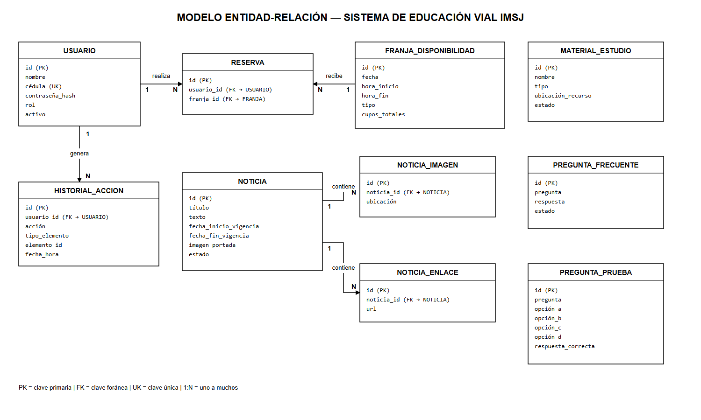
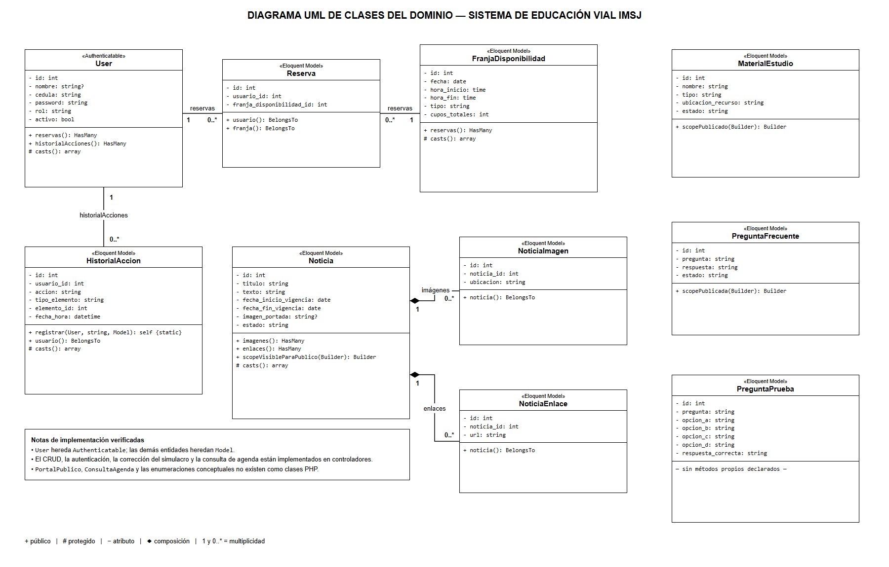
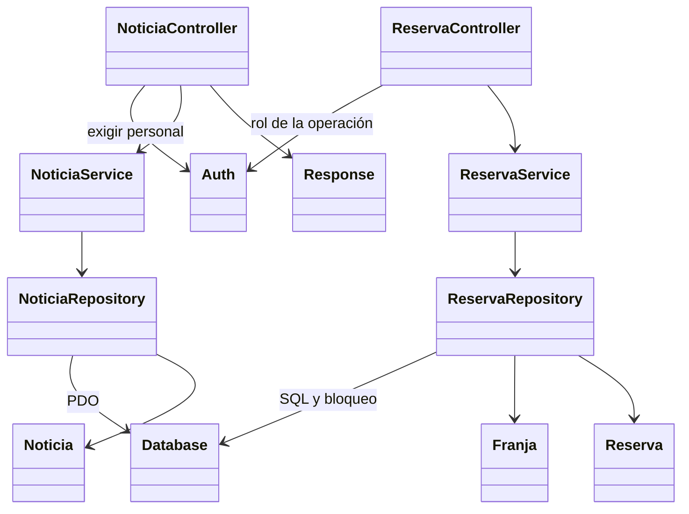

# Diagramas del proyecto y responsabilidades actuales

**Actualización - 05/10/2026.** Los PNG existentes se conservan como antecedentes del dominio; no se redibujan ni se presentan como diagramas físicos completos de la versión nueva. Las vistas Mermaid siguientes describen archivos actuales; preparación asistida por IA, revisión del equipo pendiente.

## MER histórico

Diez entidades de negocio: usuario, noticia, imagen/enlace de noticia, material, FAQ, pregunta de prueba, franja, reserva e historial. Para nombres y restricciones exactos prevalece [database.sql](../../backend/database.sql), que mantiene las diez tablas y añade `auth_tokens` como tabla técnica.

- `RESERVA.franja_id` del dibujo corresponde a `franja_disponibilidad_id`.
- La contraseña se guarda en `usuarios.password` como hash bcrypt; sin cast de ORM.
- Índices únicos: cédula, usuario/franja y fecha/inicio/fin/tipo de franja. Noticias eliminan galería/enlaces en cascada; usuario/franja no pueden borrarse mientras reservas los referencien.
- El PNG omite timestamps, índices y tokens. No hay categorías, consultas, Directora o adjuntos del test implementados.

## UML histórico y recorrido actual

La nota del PNG sobre CRUD/corrección en controladores es incompleta: el controlador atiende HTTP, el servicio coordina negocio y el repositorio ejecuta SQL. Ya no existen interfaces/Eloquent del backend anterior. Los modelos actuales representan datos y salida JSON.

Franjas y agenda pertenecen al módulo Reserva; historial al módulo Usuario. Siete controladores, siete servicios y siete repositorios. Esta vista muestra ejemplos representativos, no todas las clases o endpoints. [Modelo y justificación](../Justificación%20de%20clases,%20atributos%20y%20métodos.md), [arquitectura](../arquitectura_propuesta.md), [flujos](../flujo_endpoints_backend.md).
