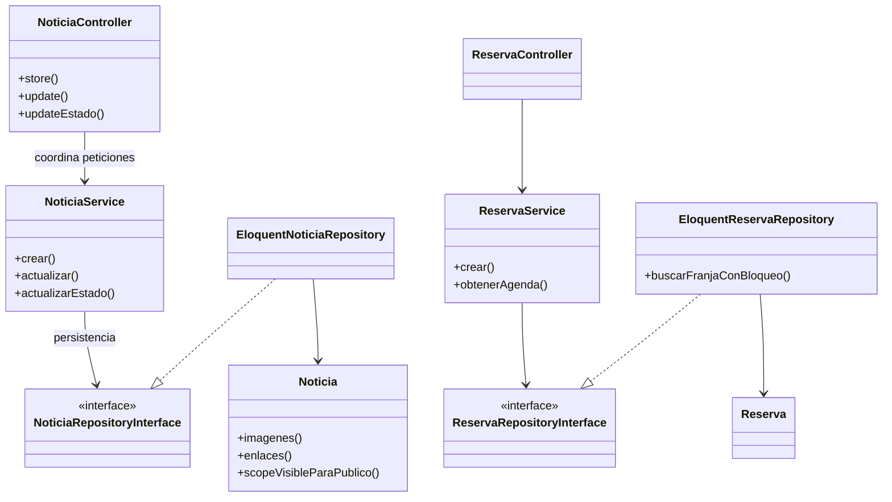
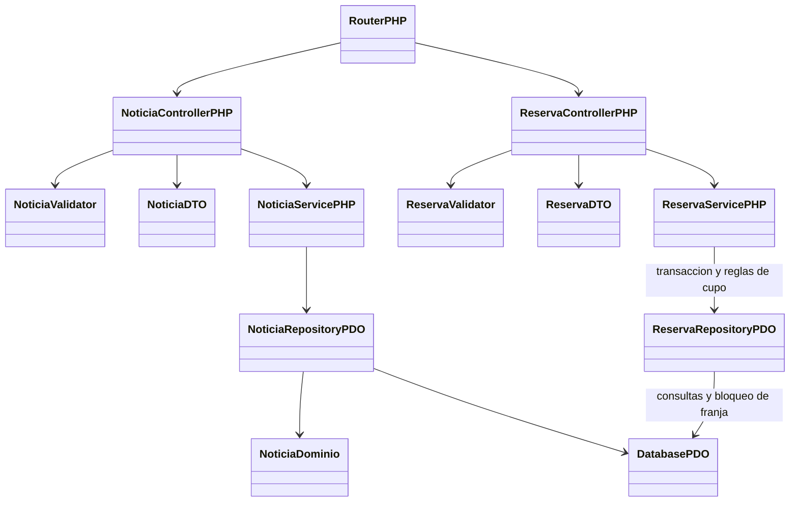

# Estado y lectura de los diagramas

> **Revisión de IA — 02/10/2026:** se inspeccionaron MER.png y UML.png y se contrastaron con esquema, modelos y servicios de `df581ab`. Las imágenes se conservan como vistas anteriores; las aclaraciones y el diagrama de responsabilidades siguiente describen el código observado, sin introducir un diseño nuevo.

**CC-05:** el grupo decide PHP sin Laravel basado en `api-completa`. El MER/UML PNG y la vista Eloquent siguiente se conservan como antecedentes; el destino por capas se representa al final y no se declara implementado. Las entidades del dominio se conservan; el cambio de framework no añade productos/ventas.

## MER

Es una vista simplificada de diez entidades de dominio, incluyendo **PreguntaPrueba**. No es evidencia de que los cambios pendientes estén implementados ni un esquema físico completo.

| Aclaración | Fuente actual |
|---|---|
| `RESERVA.franja_id` del dibujo corresponde a `reservas.franja_disponibilidad_id`. | Esquema y modelo Reserva. |
| `contraseña_hash` del dibujo corresponde a `usuarios.password`, con cast hashed. | User y migración de usuarios. |
| Tablas técnicas de tokens y timestamps no se muestran. | `personal_access_tokens` y columnas created_at/updated_at del esquema. |
| Usuario/franja tienen cero o muchas reservas; una reserva referencia exactamente un usuario y una franja. | FK no nulas; el «N» del dibujo no significa mínimo de una reserva. |
| Falta representar unicidad ciudadano/franja y fecha/inicio/fin/tipo de franja. | Índices de `schema.sql` y migraciones. |
| Galería y enlaces se eliminan en cascada con noticia. Usuario/franja mantienen restricciones de FK con reservas. | Restricciones SQL. |
| No existen tablas de categoría, consulta ciudadana ni aprobación diferenciada. | RF19/CC-02/CC-03 pendientes. |
| `PreguntaPrueba` no tiene material gráfico. | CC-04 pendiente; no se agrega al dibujo como entidad existente. |

Para nombres y restricciones físicas prevalecen las migraciones y [esquema SQL](../../backend/database/schema.sql). El esquema contiene DROP TABLE para reconstrucción; no es una migración segura sobre datos existentes.

## UML de clases de dominio

Las entidades y sus relaciones siguen siendo útiles. La nota «CRUD, autenticación y corrección implementados en controladores» está incompleta tras la separación en servicios/repositorios. Los controladores atienden HTTP y validan; los servicios coordinan los casos de uso y los repositorios el acceso a datos.

### Responsabilidades actuales que complementan el UML

**Alcance de la vista:** ejemplos de noticias y reservas que explican el patrón ya existente. No pretende enumerar todas las clases técnicas. La correspondencia completa por módulo está en [la justificación](../Justificación%20de%20clases,%20atributos%20y%20métodos.md).

No existen clases PHP `PortalPublico`, `ConsultaAgenda` ni enums PHP para los tipos conceptuales del documento inicial. Las consultas se distribuyen entre controladores, servicios, repositorios y scopes Eloquent. Los cambios de negocio pendientes deben modelarse después de que el equipo cierre sus reglas, sin mezclar estado deseado y existente.

Fuente de estructura: [modelo conceptual y físico del caso TamboTrace](https://github.com/portalutu/ing_software-3ro-bt/blob/ae1c0f118a959c5bba7fd6c8badf60de1b7ea23a/Practicos/ada-tambotrace.md).

## Responsabilidades de destino — PHP/PDO, CC-05

**IA — Diagrama de diseño derivado de la decisión del grupo:** nombres de clases ilustrativos para una adaptación por capas; aún no existen en esta forma. No enumera todas las clases ni constituye un nuevo MER físico.

Se mantienen autenticación/roles antes de las operaciones protegidas, validación antes de persistir, negocio en servicios y SQL preparado en repositorios. La agenda es académica; no se amplía a la entrega real. El esquema mantiene nombres y relaciones IMSJ; la transición de la tabla técnica de tokens sigue pendiente. Los detalles están en [modelo](../Justificación%20de%20clases,%20atributos%20y%20métodos.md), [arquitectura](../arquitectura_propuesta.md) y [migración](../migracion_backend_vanilla.md).
