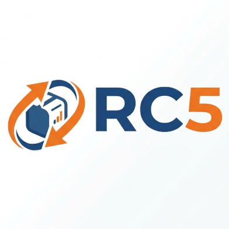

# Aclaraciones y datos pendientes del proyecto

**Proyecto:** Educación Vial IMSJ  
**Fecha de actualización:** 05/10/2026 
**Equipo:** Tomás Cabrera, Juan Robaina, Gabriela Romero, Verónica Romero y Juan Corrales.  
**Revisión y aprobación interna de documentación:** Juan Robaina; esta versión aún requiere su revisión.

Este documento reúne las aclaraciones proporcionadas por el grupo y los datos que faltan en la documentación. No reemplaza las actas ni acredita pruebas, aprobaciones o entregas que todavía no están registradas. El crédito del proyecto y su documentación corresponde a los integrantes del grupo. El apoyo externo de IA se identifica en observaciones y sugerencias, sin crédito individual al asistente.

## 1. Información aclarada por el grupo

### Equipo y responsabilidades

| Integrante | Responsabilidad confirmada |
|---|---|
| Tomás Cabrera | Líder de proyecto y desarrollador backend. |
| Juan Robaina | Testing y documentación; revisión y aprobación interna de documentos. |
| Gabriela Romero | Base de datos. |
| Verónica Romero | Desarrollo frontend. |
| Juan Corrales | Desarrollo frontend. |

La distribución anterior no asigna automáticamente responsables a tareas concretas ni a áreas adicionales, como seguridad o infraestructura. Esas asignaciones se registran cuando el equipo las acuerde.

### Cliente y forma de trabajo

| Aspecto | Aclaración confirmada |
|---|---|
| Referente del cliente | **Inspector de Tránsito de la Intendencia**, conocido como Nacho. Se utiliza principalmente el cargo; el apellido no está confirmado y no se inventa. |
| Autoridad del referente | Puede aceptar entregas y aprobar cambios de alcance. |
| Registro de aprobaciones y cambios | En las actas de reunión, donde el Inspector aprueba o solicita cambios. |
| Coordinación, revisión de cambios y avances | Se realizan en reuniones y se documentan en las actas. |
| Trabajo de las actas | Queda a cargo del equipo. Esta actualización no completa ni modifica actas. |
| Administración y mantenimiento después de la entrega real | A cargo de la Intendencia, por ahora. No se atribuye ese trabajo a una persona o proveedor no confirmado. |
| Contacto institucional | Se completará posteriormente en los términos y la política de privacidad. |

### Alcance y estado de los cambios

Las agendas son el único módulo señalado por el grupo como exclusivamente académico hasta el momento. CC-01 a CC-04 corresponden a la entrega real para la Intendencia y están **pendientes**. No hay fecha de entrega real fijada ni prioridad distinta entre estas cuatro solicitudes. Estas dos últimas aclaraciones son decisiones actuales, no campos que deban rellenarse con una fecha u orden inventados.

| Cambio | Solicitud | Estado informado por el grupo | Destino |
|---|---|---|---|
| CC-01 | Simulacros de pruebas teóricas. | Pendiente. El código de banco/corrección observado no acredita el cierre de la solicitud. | Entrega real. |
| CC-02 | Formulario de consultas en el pie del sitio y lectura en el panel IMSJ. | Pendiente. | Entrega real. |
| CC-03 | Validación por la Directora y estados Borrador, Pendiente, Aprobado y Publicado; aprobación separada de publicación. | Pendiente. | Entrega real. |
| CC-04 | Material gráfico adjunto a preguntas de los test. | Pendiente. | Entrega real. |

El rol **Directora** pertenece al sistema y a la solicitud CC-03. No debe confundirse con la función de Juan Robaina como aprobador interno de documentación, ni con la autoridad del Inspector para aceptar entregas.

### Decisión tecnológica CC-05

**Confirmada por el grupo el 02/10/2026:** retirar Laravel y basar el backend en la API completa de RodrigoCazard, con PHP sin framework, capas y PDO/MySQL. El 05/10/2026 el grupo pidió api-simple y reescritura desde cero. Código/configuración nativos y pruebas HTTP/MySQL preparados; revisión y aceptación pendientes. No se acredita despliegue Docker ni actualización de datos reales.

Se conserva como condición de transición el contrato de los frontends y el dominio IMSJ. Cookie JWT, rutas/JSON del ejemplo, roles/productos, puertos y datos de demostración no se adoptan por deducción. La [guía CC-05](migracion_backend_vanilla.md) y el [análisis de referencia](referencia_api_completa.md) describen las diferencias y las decisiones adicionales. CC-01–CC-04 mantienen su estado y destino anteriores.

## 2. Datos para completar por el equipo

Las filas siguientes identifican información o evidencia ausente; no asignan nuevas tareas, fechas ni métodos de trabajo. El equipo puede completar la última columna con el dato confirmado y un enlace al documento, acta o evidencia correspondiente. Si algo todavía no se decidió, debe conservarse como pendiente.

### Actas y registros históricos

La elaboración de [actas de reunión](actas_reuniones.md) y [Sprint Review](actas_sprint_review.md) queda íntegramente a cargo del equipo. Corresponde completar fechas, participantes, acuerdos, desacuerdos, aprobaciones o cambios pedidos por el Inspector y las tareas o plazos efectivamente acordados. No se reconstruyen esos hechos a partir del código ni se atribuyen a reuniones pasadas las aclaraciones de esta conversación.

| ID | Información por completar | Documento relacionado | Dato confirmado / evidencia |
|---|---|---|---|
| P-01 | Fecha, entrevistadores, participantes y evidencia de validación del relevamiento inicial. | [Informe de entrevista](informe%20entrevista.md). | [COMPLETAR POR EL EQUIPO] |
| P-02 | Actas y referencias concretas de decisiones, aprobaciones, cambios y seguimiento. | Actas y Sprint Review, a cargo del equipo. | [COMPLETAR POR EL EQUIPO] |
| P-03 | Planificación realmente acordada, tareas por integrante y relación con las US. Los períodos y puntos reconstruidos no son compromisos certificados. | [Planning](sprint_planning.md) y [backlog](backlog.md). | [COMPLETAR POR EL EQUIPO] |
| P-04 | Evidencia del flujo Git utilizado y de los reportes académicos que exige la consigna. No se establece una estrategia nueva. | [Revisión documental](revision_documental.md). | [COMPLETAR POR EL EQUIPO] |

### Definiciones de las solicitudes pendientes

| ID | Información por completar | Documento relacionado | Dato confirmado / evidencia |
|---|---|---|---|
| P-05 | CC-01: cantidad y selección de preguntas, duración si corresponde, criterio de resultado y responsable del banco. Los valores actuales del código no sustituyen acuerdos. | [Control de cambios](control_cambios.md), RF22 y US31. | [COMPLETAR POR EL EQUIPO] |
| P-06 | CC-02: campos del formulario, permisos para leer consultas y tratamiento/conservación de los datos. La solicitud no incorpora por sí sola respuestas o notificaciones. | Control de cambios, RF23 y US32. | [COMPLETAR POR EL EQUIPO] |
| P-07 | CC-03: contenidos afectados, quién envía/aprueba/publica, tratamiento del rechazo y de cambios posteriores a la aprobación. | Control de cambios, RF21 y US30. | [COMPLETAR POR EL EQUIPO] |
| P-08 | CC-04: formatos, cantidad y tamaño de adjuntos, obligatoriedad y presentación al resolver el test; solicitante concreto si puede documentarse. | Control de cambios, RF24 y US33. | [COMPLETAR POR EL EQUIPO] |
| P-09 | Categorías de preguntas frecuentes y acuerdo sobre subir o enlazar videos. Reglas de agenda y costo urgente únicamente para la entrega académica. | [Requerimientos](Requerimientos.md), RF19/RF20 y requisitos de agenda. | [COMPLETAR POR EL EQUIPO] |

### Entrega, operación y evidencia

| ID | Información por completar | Documento relacionado | Dato confirmado / evidencia |
|---|---|---|---|
| P-10 | Forma concreta de separar la entrega real de la agenda académica; versión que se entregará y entorno de instalación. | [Charter](project_charter.md) y [arquitectura](arquitectura_propuesta.md). | [COMPLETAR POR EL EQUIPO] |
| P-11 | Área o referente operativo dentro de la Intendencia, alojamiento, dominio y configuración de producción cuando se definan. La administración y mantenimiento institucionales ya están aclarados. | Arquitectura y [SSOO](ssoo/README.md). | [COMPLETAR CUANDO SE DEFINA] |
| P-12 | Resultados de pruebas por versión, entorno, responsable y evidencia; validaciones móviles, de accesibilidad y seguridad pendientes. | [Verificación](verificacion.md) y [seguridad](analisis_ciberseguridad.md). | [COMPLETAR POR EL EQUIPO] |
| P-13 | Evidencia de reconstrucción y restauración de respaldos; manual de usuario, entrega y aceptación final cuando correspondan. | SSOO, verificación y actas del equipo. | [COMPLETAR POR EL EQUIPO] |

### Datos institucionales, autoría y revisión

| ID | Información por completar | Documento relacionado | Dato confirmado / evidencia |
|---|---|---|---|
| P-14 | Contacto oficial, identificación institucional, domicilio y demás campos del borrador; proveedores/alojamiento, finalidades, conservación y tratamiento de menores por confirmar con la institución. | [Política de privacidad](Politica_de_Privacidad_IMSJ_Uruguay.pdf) y [términos](Terminos_y_Condiciones_IMSJ_Uruguay.pdf). | Contacto: se completará posteriormente. Resto: [COMPLETAR CON LA INSTITUCIÓN]. |
| P-15 | Titular de los derechos y denominación que debe figurar en la licencia; el archivo actual usa una denominación distinta de la Intendencia. | [LICENSE](../LICENSE). | [CONFIRMAR ANTES DE MODIFICAR LA LICENCIA] |
| P-16 | Revisión interna de esta actualización por Juan Robaina; detalle histórico de asistencia de IA y firmas de cada integrante que correspondan. Su función de revisor no acredita una aprobación ya realizada. | [Declaración de IA](declaracion_etica_ia.md). | [COMPLETAR REVISIÓN / FECHA / EVIDENCIA] |

## 3. Datos de implementación de CC-05 por completar

| ID | Información por completar | Base documentada | Dato confirmado / evidencia |
|---|---|---|---|
| P-17 | Resultado de registrar con docentes la sustitución de Laravel exigido en la letra. | Decisión del grupo confirmada; aceptación académica no registrada. | [COMPLETAR POR EL EQUIPO] |
| P-18 | Mecanismo PHP de autenticación, almacenamiento/revocación y transición de sesiones/tokens existentes. | Preservar contrato Bearer y garantías observadas; cookie JWT no aprobada automáticamente. | Implementado: Bearer opaco revocable, hash SHA-256, ocho horas; nuevo login tras transición. Revisar evidencia/aceptación. |
| P-19 | Revisión del árbol y configuración implementados. | PHP 8.5, PDO, sin paquetes externos; siete módulos del ejemplo simple, con manifiesto de extensiones. | Implementado; revisión del equipo pendiente. |
| P-20 | Ensayo de instalación Docker y actualización/restauración con copia de datos y adjuntos. | Procedimientos documentados en [SSOO](ssoo/transicion_backend_vanilla.md); SQL sin DROP ni demo. | [COMPLETAR EVIDENCIA DE EJECUCIÓN] |
| P-21 | Asignación/estimación de TM-01–TM-07, versión migrada, pruebas V-CC05 y revisión documental. | Roles generales confirmados; compromisos en reuniones/actas del equipo. | [COMPLETAR POR EL EQUIPO] |

Las alternativas que cambien autenticación visible, formato JSON, rutas, puertos o reglas del producto requieren decisión previa del grupo. La migración de framework ya fue solicitada; no se pide aprobar de nuevo esa decisión.

## 4. Lectura de las notas y fuentes

- **Aclaración del grupo:** información proporcionada directamente por el equipo y autorizada para integrar en esta actualización.
- **IA - Observación:** lectura de documentación o código con una fuente identificada; no prueba ejecución ni aceptación.
- **IA - Sugerencia:** propuesta que requiere decisión del equipo; no se incorpora como regla del producto por aparecer en un documento.
- **Pendiente / COMPLETAR:** dato o evidencia todavía no registrado. No se deducen respuestas a partir del estilo del texto.

Las responsabilidades de registrar actas, recoger feedback del cliente y obtener aceptación final se contrastaron con las [actas del curso](https://github.com/portalutu/proyecto-3ro-bt-2026/blob/841e992a88e4be1d38feaa93e10b02d69c31f8cc/docs_docentes/09_actas_de_reuniones.md), la [guía de cierre](https://github.com/portalutu/proyecto-3ro-bt-2026/blob/841e992a88e4be1d38feaa93e10b02d69c31f8cc/docs_docentes/07_cierre_de_proyecto.md) y la [guía de ética](https://github.com/portalutu/proyecto-3ro-bt-2026/blob/841e992a88e4be1d38feaa93e10b02d69c31f8cc/docs_docentes/08_etica_uso_de_ia.md). La elección de Juan Robaina para revisión y aprobación interna es una definición del grupo, no una asignación impuesta por esos ejemplos.

El [índice documental](README.md) mantiene el orden de lectura. Los PDF conservan sus páginas históricas y añaden una hoja de aclaraciones y comentarios; las cláusulas y firmas originales no se convierten automáticamente en una versión final aprobada.

## Evidencia nueva y datos que todavía faltan - 05/10/2026

Las pruebas HTTP/MySQL de la versión nativa están en [verificación](verificacion.md); P-12 no parte ahora de ausencia total de resultados. Faltan revisión y firma interna de Juan Robaina, recorrido visual completo de los frontends, ejecución Docker/Apache y ensayo de actualización/restauración. Continúan pendientes P-01 a P-17 y las definiciones funcionales de CC-01 a CC-04. El [flujo de endpoints](flujo_endpoints_backend.md) distingue comportamiento implementado de ejemplos ilustrativos y aceptación pendiente.

La estructura y autenticación PHP ya están implementadas; los campos P-18/P-19 requieren revisión/evidencia final, no volver a elegir arbitrariamente el contrato. Las actas se completan por el equipo en reuniones y no se modificaron aquí.
