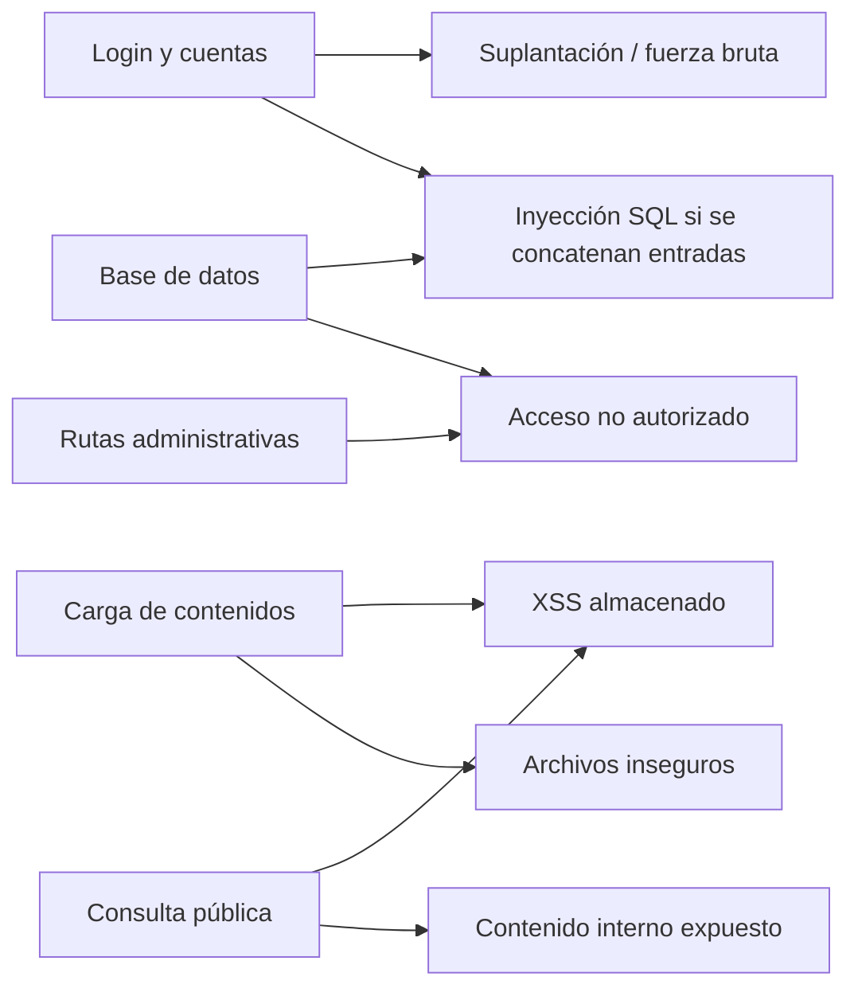

# Análisis de Ciberseguridad

**Asignatura:** Electiva Ciberseguridad — 1ª entrega (Análisis y Diseño Seguro)
**Proyecto:** Plataforma Web Educación Vial IMSJ

> **Revisión asistida por IA — 02/10/2026:** se conserva el análisis de diseño de primera entrega. La adenda final separa controles presentes en código de resultados de auditoría y decisiones pendientes. El PDF incluye una matriz adicional con valoración pendiente de justificar.

---

## 1. Amenazas digitales identificadas

| # | Amenaza | Explicación del riesgo para este proyecto |
|---|---|---|
| 1 | Inyección SQL | El login administrativo usa cédula y contraseña, y el dashboard permite crear y modificar noticias, materiales y preguntas frecuentes. Si el backend construye consultas concatenando esos datos, una entrada manipulada podría alterar la consulta, permitir el acceso sin credenciales válidas o leer, modificar y eliminar información de la base de datos. |
| 2 | XSS almacenado | El personal del IMSJ carga texto, enlaces y otros datos que luego se muestran en el frontend público. Si ese contenido se guarda y se presenta sin validación, sanitización o codificación de salida, un valor malicioso podría ejecutar código en el navegador de cada ciudadano que consulte la publicación. |
| 3 | Robo de credenciales y ataques de fuerza bruta | El acceso al panel se realiza con cédula y contraseña (RF1). Un engaño al personal, una contraseña débil o una gran cantidad de intentos automatizados podría permitir que una persona ajena ingrese al dashboard y actúe como usuario administrativo. |
| 4 | Fallas de control de acceso | El proyecto separa al público general del personal IMSJ (RNF1). Si esa separación se aplica solo en la interfaz y no se verifica en cada operación del backend, un usuario no autorizado podría invocar directamente funciones de creación, edición, publicación o eliminación de contenido. |

## 2. Mapa de riesgos

| Componente del sistema | Amenaza(s) asociada(s) | Impacto técnico | Impacto sobre usuarios |
|---|---|---|---|
| Login administrativo (RF1) | Inyección SQL; robo de credenciales; fuerza bruta | Omisión de la autenticación, acceso a una cuenta administrativa y ejecución de acciones con permisos del personal IMSJ. | Un integrante del personal podría sufrir la suplantación de su identidad y quedar asociado en el historial a cambios que no realizó. |
| Carga de contenidos (noticias, materiales y preguntas frecuentes) | XSS almacenado; fallas de control de acceso; carga de archivos inseguros | Publicación o modificación no autorizada de información, almacenamiento de contenido malicioso y pérdida de integridad de los datos. | La ciudadanía podría recibir información falsa, desactualizada o maliciosa desde un sitio que identifica como oficial. |
| Consulta pública (`frontend-publico`) | XSS almacenado; exposición de contenido no publicado | Ejecución de código en el navegador y visualización de contenidos que todavía no deberían ser públicos. | Los visitantes podrían ser redirigidos, ver contenido manipulado o acceder antes de tiempo a publicaciones internas o no aprobadas. |
| Base de datos | Inyección SQL; acceso no autorizado | Lectura, alteración o eliminación de usuarios administrativos, contenidos y registros del historial de acciones. | Podrían exponerse cédulas u otros datos vinculados a los usuarios administrativos, perderse información pública o dejar de estar disponible el servicio. |

**IA — Esquema de relaciones basado en la tabla anterior; no representa probabilidades medidas:**

El PDF anterior contiene una matriz probabilidad/impacto que no aparece en el Markdown. No se documentan escala, justificación, fuente ni quién asignó los valores. Se marca como valoración a validar, sin certificarla como medición del equipo.

## 3. Buenas prácticas de seguridad aplicables

| Práctica | Aplicación concreta en este proyecto |
|---|---|
| Validación de entradas | Para cumplir RNF2, el backend debe validar todos los datos recibidos antes de procesarlos o almacenarlos: campos obligatorios, tipo, longitud, formato y valores permitidos. Las consultas a la base de datos deben ser parametrizadas y, al mostrar contenido en los frontends, se debe aplicar codificación de salida o sanitización según el contexto. La validación del navegador sirve para orientar al usuario, pero no sustituye la validación del backend. |
| Hashing de contraseñas | Las contraseñas del personal IMSJ no deben guardarse en texto plano ni mediante cifrado reversible. Como propuesta de diseño, se utilizará `bcrypt` mediante una biblioteca mantenida, con salt individual gestionado por la propia implementación. En el login se comparará la contraseña ingresada con el hash almacenado, sin recuperar nunca la contraseña original. |
| Control de roles y permisos | Para cumplir RNF1, el backend debe comprobar la autorización en cada operación. El público solo podrá consultar contenidos que correspondan al sitio público, mientras que las operaciones de crear, editar, publicar o eliminar requerirán una sesión válida de personal IMSJ. Ocultar botones en el frontend administrativo no se considerará un control de seguridad suficiente. |
| Protección de datos personales | Para cumplir RNF4, se almacenarán únicamente los datos necesarios para autenticar e identificar las acciones del personal. La comunicación entre los frontends y la API deberá usar HTTPS; las credenciales de servicios y de base de datos se mantendrán fuera del código; y el acceso a usuarios, copias de respaldo e historial administrativo quedará restringido. |
| Registro de acciones administrativas | En relación con RNF3 y con el alcance definido en el charter, cada creación, modificación, publicación o eliminación deberá registrar como mínimo el usuario responsable, la acción, la fecha y hora y el elemento afectado. El historial debe estar protegido para que un usuario común no pueda modificarlo ni eliminarlo desde las funciones normales del dashboard. |
| Gestión segura de archivos | El proyecto contempla materiales en PDF, imágenes y videos, además de imágenes asociadas a noticias. El backend deberá aceptar solo los tipos previstos, comprobar extensión y tipo real del archivo, limitar el tamaño, generar nombres de almacenamiento seguros e impedir que los archivos cargados se ejecuten como código. |

## 4. Referencias consultadas

### Documentación interna del proyecto

- [Project Charter — Proyecto Educación Vial IMSJ](https://github.com/totito19/Proyecto-IMSJ/blob/main/docs/project_charter.md)
- [Documento de Requisitos](https://github.com/totito19/Proyecto-IMSJ/blob/main/docs/Requerimientos.md)
- [Concepción y documentación general del proyecto](https://github.com/totito19/Proyecto-IMSJ/blob/main/docs/documentacion_proyecto_imsj.md)
- [Descripción y responsabilidades del backend](https://github.com/totito19/Proyecto-IMSJ/blob/main/backend/README.md)

### Fuentes de seguridad

- [OWASP — SQL Injection](https://owasp.org/www-community/attacks/SQL_Injection)
- [OWASP — Cross Site Scripting Prevention Cheat Sheet](https://cheatsheetseries.owasp.org/cheatsheets/Cross_Site_Scripting_Prevention_Cheat_Sheet.html)
- [OWASP — Authentication Cheat Sheet](https://cheatsheetseries.owasp.org/cheatsheets/Authentication_Cheat_Sheet.html)
- [OWASP — Authorization Cheat Sheet](https://cheatsheetseries.owasp.org/cheatsheets/Authorization_Cheat_Sheet.html)
- [OWASP — Input Validation Cheat Sheet](https://cheatsheetseries.owasp.org/cheatsheets/Input_Validation_Cheat_Sheet.html)
- [OWASP — Password Storage Cheat Sheet](https://cheatsheetseries.owasp.org/cheatsheets/Password_Storage_Cheat_Sheet.html)
- [OWASP — Logging Cheat Sheet](https://cheatsheetseries.owasp.org/cheatsheets/Logging_Cheat_Sheet.html)
- [OWASP — File Upload Cheat Sheet](https://cheatsheetseries.owasp.org/cheatsheets/File_Upload_Cheat_Sheet.html)

---

## 5. Estado observado y evidencia pendiente — 02/10/2026

**IA — Observación de código, no auditoría ejecutada:**

| Control | Evidencia observada | Límite / verificación pendiente |
|---|---|---|
| Hash de contraseña | Cast hashed en User y uso de mecanismos Laravel en autenticación. | No se certifican todas las credenciales existentes ni seguridad de datos iniciales. |
| Autenticación y autorización | Sanctum; middleware público/personal; login/registro limitados con `throttle:5,1`. | Directora y aprobación de CC-03 no implementadas. Resultados de pruebas no adjuntos. |
| Tokens | AuthService emite por ocho horas y revoca anteriores; JS usa sessionStorage. | Comprobar expiración, logout y riesgo de XSS en entorno de entrega. |
| Validación y archivos | Reglas en controladores; imágenes de noticias y PDF/imágenes de estudio gestionados por servicios/filesystem. | Límites actuales son implementación, no acuerdo. VIDEO es enlace; CC-04 pendiente. |
| Auditoría | HistorialAccion registra usuario/acción/fecha/elemento; rutas de consulta reservadas a personal. | No hay valores anterior/nuevo. Cobertura completa y retención no definidas. |
| Infraestructura | MySQL sin puerto publicado, frontends de solo lectura y entorno descrito en SSOO. | HTTPS, hardening completo, secretos de producción, respaldo/restauración y monitoreo pendientes. |
| Cupos de agenda académica | Transacción y bloqueo de fila en ReservaService/repositorio. | Pruebas de capacidad SQLite no demuestran concurrencia real MySQL. |

No se debe asumir sanitización/codificación de salida completa por usar Laravel: los frontends construyen contenido con `innerHTML` en varios módulos. Se requiere revisión contextual y evidencia SAST/DAST; no se declara aquí una vulnerabilidad explotada ni una corrección de código.

Los archivos y resultados pendientes están en [verificación](verificacion.md). Los términos y la política conservan datos por completar; los comentarios de PDF no sustituyen decisiones institucionales ni revisión jurídica.

## 6. Transición de controles a PHP sin Laravel — CC-05

**Decisión del grupo, 02/10/2026:** retirar Laravel y utilizar las capas/PDO de la API completa. La sección 5 describe el código anterior todavía presente; no se acredita una auditoría de la versión PHP. La [migración](migracion_backend_vanilla.md) y el [análisis de referencia](referencia_api_completa.md) detallan la sustitución.

| Control que debe conservarse | Responsabilidad explícita en PHP | Evidencia pendiente |
|---|---|---|
| Contraseñas y login | `password_hash`/`password_verify`, compatibilidad de hashes existentes y rechazo de credenciales inválidas. | Usuarios actuales y cuentas nuevas sin exponer hashes ni claves. |
| Sesión y roles | Validación de Bearer, expiración/revocación, usuario activo, rol y propiedad según la operación. | Logout invalida token, renovación revoca anteriores, cuenta desactivada/rol incorrecto rechazados. |
| SQL y negocio | Repositorios PDO con parámetros; transacciones y restricciones del dominio. | Entradas inválidas sin persistencia parcial; reservas concurrentes en MySQL. |
| Entradas y JSON | Validadores/DTO y respuestas compatibles; errores controlados sin detalles internos. | JSON/formularios/id/fechas y archivos inválidos; errores entendidos por frontends. |
| Archivos y raíz pública | MIME/tamaño/nombres/permisos y URLs preservadas; secretos/código fuera del acceso web. | Carga y descarga de PDF/imágenes; ejecución y acceso a `.env`/SQL/caché denegados. |
| Auditoría y publicación | Registrar cambios con identidad/fecha/elemento; filtrar estado y vigencia en repositorios. | Historial y portal consistentes tras cada operación; sin publicar contenido interno. |
| CORS e intentos | Origen/métodos/cabeceras usados por ambos frontends y política de intentos existente. | OPTIONS/Bearer/PUT/multipart; exceso de intentos de login/registro. |

**IA — Límites de la referencia:** cookie JWT de una hora y logout que solo elimina la cookie no equivalen a las sesiones de ocho horas con revocación de IMSJ. Sus claims no reconsultan estado/rol en cada petición; su límite global 60/min no equivale al límite de login actual. Estas diferencias requieren adaptación o decisión expresa, sin tratarlas como controles ya implementados.

Si el grupo propone cambiar Bearer por cookie, debe aprobar y documentar conjuntamente transporte, CORS y protección de las operaciones frente a CSRF. Esa alternativa permanece sin adopción; no se modifica el frontend en esta revisión.

El hashing y las consultas preparadas siguen los mecanismos de [verificación de contraseñas PHP](https://www.php.net/manual/en/function.password-verify.php) y [PDO](https://www.php.net/manual/en/pdo.prepared-statements.php). No se promete seguridad completa por usar esas funciones. La valoración de la matriz histórica, HTTPS, SAST/DAST y restauración siguen pendientes. Ver V-CC05 en [verificación](verificacion.md).
