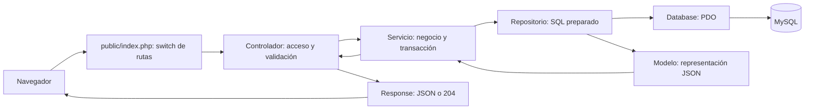
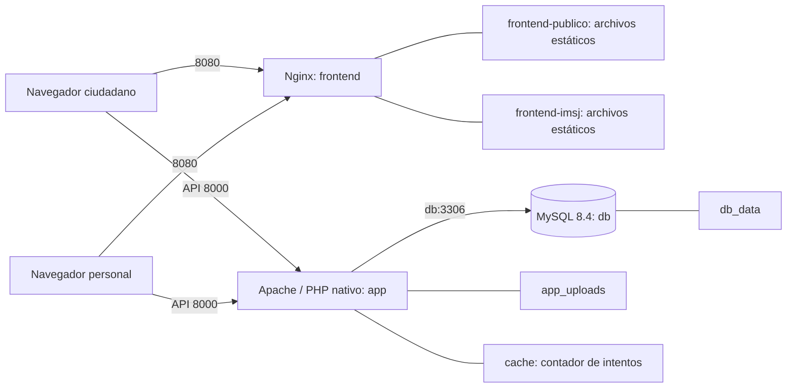

# Arquitectura del backend y despliegue local

**05/10/2026 - CC-05 implementado en la versión de trabajo.** PHP nativo con la estructura de siete módulos solicitada por el grupo. Documentación asistida por IA; revisión interna pendiente. La prueba HTTP/MySQL no acredita el despliegue Docker ni aceptación.

## Recorrido de una petición

Carga explícita como api-simple, sin Router separado ni middleware de framework. Cada controlador exige su acceso con Auth y usa Solicitud para validar. Siete módulos: Auth, Noticia, Material, Pregunta, Prueba, Reserva y Usuario. Reserva incluye franjas/agenda; Usuario incluye historial. [Árbol y arranque](../backend/README.md), [flujos](flujo_endpoints_backend.md).

## Topología definida en Compose

Se conservan frontend/app/db y los volúmenes previos de negocio y adjuntos. MySQL no publica puerto al host en Compose. Los puertos locales se vinculan a 127.0.0.1; las direcciones JavaScript siguen siendo localhost:8000 y el sitio localhost:8080. Cambiar puertos exige revisar esas direcciones con el equipo. No existe proxy de API en Nginx.

## Datos y seguridad

Las diez tablas del dominio mantienen nombres, claves e índices. `auth_tokens` sustituye las sesiones técnicas del framework: secreto aleatorio revocable, solo hash SHA-256, ocho horas. Configuración fuera de public; raíz Apache en public, adjuntos fuera de la raíz y servidos con tipos comprobados. Consultas parametrizadas, cuenta/rol comprobados en cada operación y auditoría administrativa dentro de la transacción.

Reserva bloquea la franja con SELECT FOR UPDATE antes de contar cupos, duplicación y guardar. Los archivos nuevos se limpian si falla SQL/auditoría; los anteriores se eliminan después del commit. [Esquema](../backend/database.sql), [diagramas](Diagramas/README.md) y [verificación](verificacion.md).

## Alcance y pendientes de despliegue

Agenda/reservas siguen siendo académicas. CC-01 a CC-04 continúan pendientes para la entrega real. No se añade Directora o aprobación diferenciada al modelo actual.

La Intendencia administrará y mantendrá el sistema por ahora; su contacto se completará luego. Dominio, HTTPS, alojamiento, respaldos institucionales, conservación de datos y aceptación académica de la tecnología todavía necesitan definiciones del equipo. [Pendientes](aclaraciones_y_pendientes.md). No se presentan esas propuestas como infraestructura ya ejecutada.
