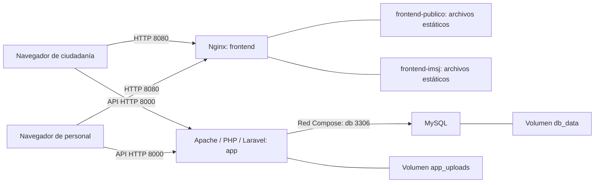
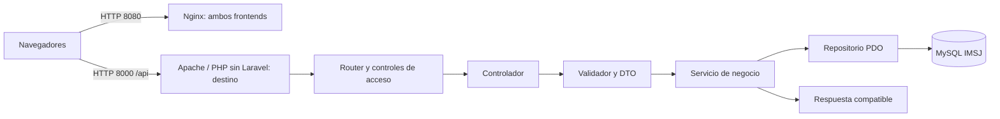

# Arquitectura propuesta — transición a PHP sin Laravel

> **CC-05 — Decisión del grupo, 02/10/2026:** destino PHP sin Laravel, por capas y con PDO, basado en `api-completa`. El código y los archivos de infraestructura aún utilizan Laravel. El contenido previo se conserva como referencia de esa versión; la migración y sus pruebas están pendientes. Ver [transición documentada](migracion_backend_vanilla.md).

**Asignatura:** Administración de Sistemas Operativos (Adm. SSOO) — actualizada para la 2ª entrega
**Proyecto:** Plataforma Web Educación Vial IMSJ

> **Revisión asistida por IA — 02/10/2026:** se distingue diseño propuesto de archivos presentes en `df581ab`. La descripción y el diagrama no acreditan un despliegue ejecutado. Reglas nuevas de aprobación y consultas siguen pendientes.

---

## 1. Visión general de la arquitectura

La solución se organiza como una aplicación web de tres capas. La capa de presentación está dividida en
dos interfaces independientes: `frontend-publico`, orientado a la ciudadanía, y `frontend-imsj`, destinado
al personal administrativo. Ambas interfaces se comunican mediante solicitudes HTTP con un backend común,
expuesto como API REST. El backend centraliza la lógica de negocio, la autenticación, la autorización, la
validación de datos y el acceso a la base de datos.

La agenda forma parte del proyecto de egreso por su complejidad técnica,
pero queda excluida de la entrega al cliente por petición de este. Por lo tanto, la arquitectura contempla
reservas y franjas de disponibilidad para la versión académica, sin presentarlas como parte de la entrega
comprometida con la IMSJ.

## 2. Topología actual anterior a la migración CC-05

**IA — Representación de archivos existentes:** topología local definida en `backend/compose.yaml`; no propone servicios adicionales.

Los navegadores ejecutan JavaScript que llama a la API; Nginx publica archivos y no actúa actualmente como proxy de la API. Solo el backend accede a MySQL. Los puertos son los predeterminados; HTTPS corresponde a un despliegue futuro, no al entorno local descrito.

## 3. Componentes

| Componente | Tecnología presente antes de CC-05 | Responsabilidad |
|---|---|---|
| Frontend público | Aplicación web basada en HTML5, CSS3 y JavaScript. No se documenta el uso de un framework. | Permitir a la ciudadanía consultar noticias, materiales de estudio y preguntas frecuentes. En la versión académica también permitirá solicitar turnos; esta función queda fuera de la entrega al cliente. |
| Frontend IMSJ (dashboard) | HTML5, CSS3 y JavaScript, de acuerdo con los archivos actuales de `frontend-imsj`. | Permitir al personal iniciar sesión y administrar noticias, materiales, preguntas frecuentes y su visibilidad. En la versión académica también incluye la gestión de franjas y la consulta de la agenda. |
| Backend / API | PHP 8.5 y Laravel 13 como API REST. | Centralizar la lógica de negocio, autenticar y autorizar usuarios, validar solicitudes, prevenir operaciones inválidas y controlar todo acceso a datos y archivos. |
| Base de datos | MySQL 8.4. | Persistir usuarios, noticias, materiales, preguntas frecuentes, estados de publicación e historial de acciones. Para la versión académica también almacenará franjas y reservas. |
| Archivos de contenido | Filesystem administrado por Laravel. | Conservar y servir imágenes de noticias, PDF e imágenes de estudio. Los videos actualmente se referencian mediante URL HTTP/HTTPS; no se almacenan como archivos. Esta diferencia debe validarse con el relevamiento. |

## 4. Infraestructura propuesta

**Aclaración del grupo — 02/10/2026:** la administración y el mantenimiento después de la entrega real quedan a cargo de la Intendencia, por ahora. El contacto institucional se completará posteriormente. Esto no define proveedor, dominio, alojamiento ni configuración de producción. Las agendas corresponden exclusivamente al alcance académico señalado por el grupo; CC-01–CC-04 están pendientes para uso real. Ver [aclaraciones y pendientes](aclaraciones_y_pendientes.md).

| Aspecto | Definición | Estado |
|---|---|---|
| Entorno de despliegue | Tres contenedores Docker: Nginx para los dos frontends estáticos, Laravel con Apache para la API y MySQL para los datos. | Definidos en `backend/compose.yaml`. |
| Sistema operativo del servidor | Linux, provisto por la imagen oficial `php:8.5-apache`. | Definido en `backend/Dockerfile`. |
| Dispositivos del personal IMSJ | El sistema será accesible mediante navegador web. No se relevaron modelos, sistemas operativos ni características concretas de los equipos utilizados por el personal. | Requisito de acceso web definido; hardware pendiente de relevamiento. |
| Requisitos de red / acceso | El frontend público queda disponible para la ciudadanía y el dashboard se reserva al personal autorizado. En desarrollo la API usa el puerto 8000; en producción deberá publicarse mediante HTTPS. | Desarrollo definido; dominio y certificado quedan pendientes del despliegue real. |

La infraestructura reproducible está definida en `backend/Dockerfile`,
`backend/compose.yaml` y `backend/.env.example`. La elección previa de Laravel respondía a la letra IMSJ. CC-05 la sustituye por
PHP sin framework por decisión del grupo; la aceptación académica de esa diferencia
queda por registrar con docentes. MySQL, Docker y los dos frontends se conservan.

## 5. Consideraciones de seguridad de la arquitectura

La separación entre el frontend público y el dashboard debe mantenerse también en el backend. No alcanza
con ocultar enlaces o botones: cada endpoint administrativo debe exigir autenticación y verificar que el
usuario pertenece al personal IMSJ, en cumplimiento de RNF1.

Las entradas recibidas por la API deben validarse en el servidor antes de ser procesadas o persistidas
(RNF2). El contenido que luego se muestre en los frontends debe tratarse de forma segura para evitar XSS,
y las operaciones sobre la base de datos deben utilizar consultas parametrizadas. Los archivos cargados
deben limitarse a los formatos previstos por el proyecto y validarse antes de su almacenamiento.

Las contraseñas no deben almacenarse en texto plano. Las credenciales de la base de datos y otros secretos
deben mantenerse fuera del código fuente, y toda comunicación entre los navegadores y la API debe viajar
mediante HTTPS. La protección de datos debe abarcar tanto a los usuarios administrativos como a los datos
de ciudadanos que se utilicen en la agenda académica (RNF4).

El backend debe registrar las acciones administrativas requeridas por RNF3, incluyendo usuario, acción,
fecha y elemento afectado. También se deberán definir copias de respaldo y un procedimiento de
restauración para la base de datos y los archivos. En el módulo académico de agenda, la asignación de un
cupo debe ejecutarse como una operación atómica para impedir dobles reservas (RNF8).

## 6. Riesgos de arquitectura identificados

| Riesgo | Impacto | Mitigación propuesta |
|---|---|---|
| Diferencias entre el entorno de desarrollo y el de entrega | Pueden provocar que el sistema funcione en una computadora y falle en otra. | Usar los mismos archivos Docker y variables de entorno documentadas para reconstruir Laravel y MySQL. |
| Acceso directo o no autorizado a funciones administrativas | Una persona ajena podría crear, modificar, publicar o eliminar información. | Centralizar la autorización en el backend y verificar una sesión válida y el rol correspondiente en cada endpoint administrativo. |
| Caída del backend o de la base de datos | Ambos frontends perderían acceso a la información y a las operaciones del sistema. | Definir monitoreo, manejo controlado de errores, copias de respaldo y un procedimiento probado de restauración. |
| Pérdida o corrupción de datos y archivos | Podrían desaparecer noticias, materiales, preguntas frecuentes, reservas o registros de auditoría. | Aplicar validaciones, transacciones cuando correspondan, respaldos periódicos y restricciones de acceso a la persistencia. |
| Doble reserva de una franja | Dos ciudadanos podrían ocupar el mismo cupo y la agenda quedaría inconsistente. | Ejecutar la comprobación y la confirmación como una única operación atómica en la capa de persistencia, de modo que solicitudes simultáneas no puedan superar los cupos disponibles. |
| Carga de archivos inseguros | Un archivo podría afectar al servidor o a los ciudadanos que accedan a los materiales. | Permitir solo los formatos definidos, validar extensión y tipo real, limitar tamaño, usar nombres seguros e impedir la ejecución de los archivos cargados. |
| Diferencia entre la versión académica y la entrega al cliente | Podría generarse confusión sobre qué módulos deben demostrarse o instalarse para la IMSJ. | Mantener documentada la agenda como alcance académico y separarla claramente de la entrega comprometida con el cliente. |

## 7. Documentación consultada

### Correspondencia con el backend actual

El backend tiene **controladores → servicios → interfaces de repositorio → repositorios Eloquent/modelos**. Los controladores reciben HTTP y validan; los servicios coordinan negocio y transacciones; los repositorios acceden a persistencia. Los recursos de respuesta presentan los datos. Ver [API](api.md) y [diagramas](Diagramas/README.md).

**IA — Observación:** los roles actuales son público/personal y los estados son publicado/no publicado. CC-03 solicita Directora y cuatro estados; no es un control implementado. No se localizaron circuito de consultas CC-02, categorías RF19 o gráficos CC-04. La agenda continúa presente en ambos frontends de esta versión; no está documentada una entrega técnica separada para el cliente.

`localhost:8000` está fijado en los JavaScript. La topología actual solo describe el arranque local; publicar desde otra máquina, cambiar el puerto o añadir HTTPS exige decisiones/configuración que no se resuelven modificando esta documentación.

### Fuentes originales

- [Project Charter — Proyecto Educación Vial IMSJ](https://github.com/totito19/Proyecto-IMSJ/blob/main/docs/project_charter.md)
- [Documento de Requisitos](https://github.com/totito19/Proyecto-IMSJ/blob/main/docs/Requerimientos.md)
- [Concepción y documentación general del proyecto](https://github.com/totito19/Proyecto-IMSJ/blob/main/docs/documentacion_proyecto_imsj.md)
- [Descripción y responsabilidades del backend](https://github.com/totito19/Proyecto-IMSJ/blob/main/backend/README.md)
- [Estructura general del repositorio](https://github.com/totito19/Proyecto-IMSJ/blob/main/README.md)

---

## 8. Arquitectura de destino — CC-05

La decisión del grupo cambia la aplicación dentro del servicio `app` a PHP sin framework de aplicación. Se toma el patrón por capas de la API completa; Composer puede seguir instalando bibliotecas puntuales. PHP 8.5, MySQL 8.4, Nginx, servicios y puertos locales se conservan como base de adaptación.

**IA — Representación del destino, todavía no implementado:** los controladores adaptan HTTP, los validadores/DTO filtran entrada, los servicios conservan reglas y transacciones, los repositorios ejecutan SQL preparado y los modelos serán objetos del dominio. Router, configuración y respuestas se adaptan a IMSJ; productos/ventas del ejemplo no forman parte del proyecto.

| Área que cambia | Condición de migración |
|---|---|
| Arranque, rutas y middleware Laravel | Entrada PHP y router propio con `/api`, métodos, parámetros y autorización explícita. |
| Eloquent y recursos JSON | PDO, objetos PHP y serialización compatible con los frontends. |
| Sanctum y gestión de credenciales | Reemplazo PHP con Bearer, expiración/revocación y permisos; formato de token y transición de sesiones por confirmar. |
| Filesystem, migraciones y Artisan | Gestión de archivos y procedimientos SQL/arranque revisados sin perder datos o URLs. |
| Docker y pruebas | Manifiestos/scripts adaptados y resultados de integración MySQL/frontends antes del cierre. |

**IA — Riesgos de transición:** copiar cookie JWT/JSON del ejemplo rompería los consumidores; retirar middleware sin reemplazarlo perdería controles; reconstruir con DROP pondría en riesgo datos; las pruebas Laravel no validan la nueva API por existir. La guía exige compatibilidad, respaldo/restauración y evidencia antes del cierre, sin dar esas condiciones por realizadas.

El [plan CC-05](migracion_backend_vanilla.md) detalla capas, datos, tareas y cierre; la [comparación de referencia](referencia_api_completa.md) declara alternativas que necesitan otra decisión. La [transición SSOO](ssoo/transicion_backend_vanilla.md), el [contrato](api.md) y la [verificación](verificacion.md) son documentos complementarios. CC-01–CC-04 conservan su estado pendiente; agenda únicamente académica. Revisión interna de Juan Robaina pendiente, aceptaciones del Inspector en actas a cargo del equipo.
