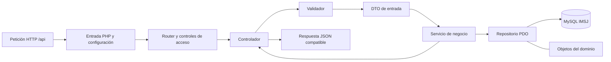

# Migración del backend a PHP sin Laravel — CC-05

**Proyecto:** Educación Vial IMSJ  
**Fecha:** 02/10/2026  
**Decisión del grupo:** retirar Laravel y basar el backend en `api-completa` de RodrigoCazard/api-ejemplo-utu.  
**Estado:** documentación preparada; migración de código, configuración, datos y pruebas pendiente.  
**Equipo:** Tomás Cabrera, Juan Robaina, Gabriela Romero, Verónica Romero y Juan Corrales.  
**Revisión documental interna:** Juan Robaina; aprobación de esta versión pendiente.

> **Asistencia de IA identificada:** la decisión tecnológica viene del grupo. El análisis de correspondencia y la secuencia de trabajo son aportes documentales para revisión. No acreditan una migración ejecutada ni agregan funciones de producto.

## 1. Alcance de la decisión

El destino es una API REST en PHP sin framework de aplicación, organizada por capas y conectada a MySQL mediante PDO. Composer puede seguir instalando bibliotecas específicas: «vanilla» no significa eliminar el gestor ni reescribir bibliotecas de seguridad. La referencia también utiliza Composer.

CC-05 afecta al backend común de ambas interfaces y, por tanto, a las funciones reales y a la agenda académica. Conserva el dominio de IMSJ, sus dos frontends, MySQL y la infraestructura Docker. No añade productos, ventas ni usuarios de demostración de la referencia. CC-01–CC-04 siguen pendientes para entrega real, sin fecha ni prioridad distinta entre ellos; cambiar el framework no cierra esas solicitudes.

La migración debe conservar el comportamiento consumido por los frontends, salvo que el grupo apruebe por separado una modificación. Se utiliza el [contrato de API](api.md) como inventario de compatibilidad. Las diferencias cookie/Bearer, JSON y rutas de la referencia están declaradas en [análisis de la API base](referencia_api_completa.md).

**Relación con la consigna:** la [letra IMSJ consultada](https://github.com/portalutu/proyecto-3ro-bt-2026/blob/841e992a88e4be1d38feaa93e10b02d69c31f8cc/Proyectos/proyecto_educacion_vial_IMSJ.md) indica PHP/Laravel. CC-05 es una decisión explícita del grupo que cambia esa tecnología. Falta registrar con docentes la aceptación académica de la diferencia; no se declara que la consigna haya cambiado o que el cliente/docentes hayan aprobado ya la sustitución.

## 2. Qué existe y qué se debe sustituir

La línea base inspeccionada es `df581ab`; las aclaraciones documentales posteriores no migraron el software.

| Parte | Implementación existente | Destino de CC-05 / trabajo pendiente |
|---|---|---|
| Arranque HTTP | `public/index.php`, bootstrap y kernel de Laravel. | Punto de entrada PHP que carga configuración, dependencias, rutas y controles. |
| Rutas | `routes/api.php`, middleware y binding de modelos. | Router de la referencia adaptado a `/api`, parámetros de IMSJ y métodos actuales. Buscar entidades explícitamente en repositorios. |
| Controladores | `Illuminate\Http\Request`, validación y respuestas Laravel. | Lectura explícita de JSON/formularios/archivos; validadores, DTO y respuestas compatibles. |
| Negocio | Servicios con dependencias de Laravel, fechas y transacciones del framework. | Servicios PHP conservando vigencia, cupos, permisos, auditoría y reglas existentes. |
| Persistencia | Interfaces de repositorio e implementaciones Eloquent; modelos ORM. | Repositorios PDO y objetos del dominio; consultas preparadas y transacciones explícitas. |
| Autenticación | Sanctum; tokens Bearer, vencimiento y revocación. | Autenticación PHP compatible con el contrato. Diseño de tokens y transición de sesiones por confirmar, sin adoptar automáticamente la cookie JWT del ejemplo. |
| Respuestas | Recursos JSON y errores con `message`/`errors`. | Serialización explícita que mantiene nombres, tipos, relaciones y envoltorios actuales. |
| Archivos | Filesystem público de Laravel, URLs y enlace de almacenamiento. | Validación y almacenamiento PHP preservando rutas/datos/URLs o declarando una transición aprobada. |
| Esquema e inicio de datos | Migraciones/seeders Artisan; `schema.sql` de reconstrucción. | Instalación y actualizaciones SQL documentadas para IMSJ; procedimiento sobre datos existentes por preparar. |
| Construcción y scripts | Composer Laravel, `artisan`, permisos de `bootstrap/cache`, Batch. | Manifiestos, imagen y scripts adaptados al arranque PHP, sin pasos del framework. |
| Pruebas | Siete archivos Feature con 22 métodos dependientes de Laravel. | Adaptar escenarios a la API PHP y probar integración con MySQL/frontends. No pueden darse por válidos sin adaptación y ejecución. |

## 3. Organización por capas

La referencia separa `core`, `controllers`, `validators`, `dtos`, `services`, `repositories` y `models`. El [diagrama actualizado](Diagramas/README.md) distingue el destino del código anterior.



**IA — Organización sugerida para implementar CC-05:** el árbol siguiente todavía no existe en IMSJ. Adapta las carpetas de la referencia y conserva la raíz web `public/` ya utilizada. Los nombres concretos se validarán durante la implementación; no se introduce otro framework, un contenedor de inyección ni una estrategia nueva de ramas.

```text
backend/
  public/          index.php y reglas de publicación HTTP
  config.php       carga/validación de configuración
  routes.php       rutas IMSJ, acceso y despacho
  core/            Router, Database, Response y autenticación
  controllers/     adaptación HTTP por módulo
  validators/      reglas de entrada por operación
  dtos/            datos permitidos para los casos de uso
  services/        negocio y coordinación de transacciones
  repositories/    consultas PDO al esquema IMSJ
  models/          objetos del dominio y presentación de sus datos
  database/        esquema/actualizaciones/datos iniciales IMSJ
  storage/         archivos, registros y caché que correspondan
  tests/           escenarios adaptados
  composer.json / composer.lock
  Dockerfile / compose.yaml / .env.example
```

Los controladores atienden HTTP; los validadores comprueban entradas antes de crear DTO; los servicios aplican reglas; los repositorios ejecutan SQL; los modelos representan entidades. El dato `id`, la cédula y los nombres de tablas de IMSJ no se sustituyen por el dominio de productos del ejemplo. Las funciones de `core` son soporte común, sin reglas de noticias o reservas dentro del router.

## 4. Compatibilidad que debe preservarse

| Aspecto | Condición de migración |
|---|---|
| Direcciones | Mantener base local `http://localhost:8000/api` y las 42 rutas del inventario actual. No sustituir `/register` por `/registro`, `/me` por `/perfil` o contenidos por `/productos`. |
| Métodos | Mantener GET, POST, PUT, PATCH y DELETE donde están declarados; responder OPTIONS para CORS. El router original solo reconoce `{id}` y debe adaptarse a parámetros como `{noticia}` y segmentos posteriores como `/estado`. |
| Formularios | Conservar POST multipart con `_method=PUT` enviado por noticias/materiales para editar. Procesar el método efectivo antes de elegir ruta, restringiendo la sustitución a las operaciones previstas. |
| Autenticación | Login por `cedula` y `password`; registro con confirmación; respuesta raíz `token`, `expira_en`, `usuario`; envío `Authorization: Bearer`. Sin introducir cookies o campos `email`/`clave` por copiar el ejemplo. |
| Sesión | Preservar vencimiento de ocho horas, revocación de tokens anteriores al emitir uno nuevo y revocación en logout, salvo decisión específica del grupo. Estos son comportamientos observados, no acuerdos institucionales inventados. |
| Permisos | Comprobar usuario y rol en servidor en cada ruta protegida; público/personal. El rol Directora y sus estados pertenecen a CC-03 pendiente. |
| JSON | Mantener `data` cuando corresponda, errores `message`/`errors`, perfil y respuestas sin contenido. El envoltorio `ok`/`mensaje`/`datos` del ejemplo no es compatible directamente. |
| Contenidos | Mantener filtros de publicación/vigencia, límites actuales de archivos y forma de sus URLs hasta que se acuerde un cambio. VIDEO sigue como enlace HTTP/HTTPS. |
| Agenda académica | Mantener pertenencia de reservas, fecha/cupos, unicidad y bloqueo/transacción en MySQL. No retirar la agenda de la evaluación ni extenderla a la entrega real por esta migración. |
| Historial | Conservar usuario, acción, fecha y elemento; no borrar auditoría ni desactivaciones al pasar de Eloquent a PDO. |

El inventario de rutas es una lectura de código. Los ejemplos de JSON y las pruebas pendientes están en [API](api.md) y [verificación](verificacion.md); deben cotejarse contra respuestas ejecutadas antes de dar la compatibilidad por cumplida.

## 5. Datos y archivos existentes

El [esquema SQL](../backend/database/schema.sql) tiene diez tablas del dominio: `usuarios`, `noticias`, `noticia_imagenes`, `noticia_enlaces`, `materiales_estudio`, `preguntas_frecuentes`, `preguntas_prueba`, `franjas_disponibilidad`, `reservas` e `historial_acciones`. Además contiene `personal_access_tokens`, propia de la autenticación actual. La tabla técnica de migraciones puede existir en bases creadas por Artisan aunque no figure en ese esquema.

**IA — Condiciones derivadas de conservar el sistema:**

1. Inventariar base, archivos y configuración de la instalación concreta; comprobar qué datos existen. No asumir que todas las instalaciones son nuevas.
2. Respaldar base y archivos juntos y comprobar restauración antes de intervenir sobre una instalación con datos. Registrar versión y ubicación de respaldo sin publicar secretos.
3. Conservar identificadores, relaciones, cédulas, hashes de contraseña, estados, fechas, historial y rutas de archivos. Verificar que PHP reconoce los hashes existentes con `password_verify`; no convertir contraseñas a texto plano ni volver a crear cuentas por copiar los seeders de ejemplo.
4. Preparar y revisar las consultas/actualizaciones sobre el esquema real. `schema.sql` de IMSJ contiene DROP TABLE: sirve para reconstrucción aislada, no para actualizar datos existentes. Tampoco importar `utu_demo`/productos de la referencia.
5. Resolver la transición de `personal_access_tokens`: conservar un almacén compatible o invalidar sesiones de forma explícita al cambiar el formato. Opción, comunicación y evidencia pendientes; no se borra esa tabla ni se obliga a reautenticación por escribir este documento.
6. Mantener las rutas persistidas y las URLs públicas de materiales/imágenes; si cambian, preparar correspondencia y verificar cada enlace. No confundir caché del limitador del ejemplo con el volumen de contenidos.

La restauración para volver a la versión anterior debe contemplar código/configuración y datos/archivos compatibles. Si el esquema cambia, reinstalar la imagen Laravel por sí sola no garantiza una reversión. El procedimiento concreto y su ejecución siguen pendientes.

## 6. Seguridad al retirar el framework

PDO, `password_hash` y `password_verify` cubren mecanismos concretos; no reemplazan por sí solos la autorización, validación o auditoría. El [análisis de seguridad](analisis_ciberseguridad.md) registra la transición por control.

- Usar consultas preparadas y validar cualquier identificador/orden dinámico antes de construir SQL. No concatenar entradas en consultas.
- Resolver y comprobar identidad, expiración, revocación, usuario activo y rol antes de ejecutar la operación. El JWT de la referencia verifica firma/expiración, pero su logout solo borra la cookie y no aporta revocación en servidor.
- Mantener restricciones de intentos de login/registro; la política global de 60 peticiones/minuto del ejemplo es distinta de `throttle:5,1` actual y no se adopta sin revisión.
- Validar JSON, parámetros y archivos; rechazar datos inválidos antes de persistir y mantener errores comprensibles sin exponer SQL, secretos o trazas de producción.
- Configurar CORS para el origen del frontend y permitir `Authorization`, `Content-Type` y métodos utilizados. El ejemplo permite cookies y otra lista de cabeceras; necesita adaptación al contrato IMSJ.
- Publicar solo la raíz prevista, mantener `.env`, SQL, bibliotecas, registros y código interno fuera del acceso web; impedir ejecución de archivos cargados. Verificarlo en la imagen final, no solo en el archivo de reglas.
- Conservar transacciones/bloqueos de agenda y registro administrativo. La operación de descontar stock del ejemplo usa un UPDATE condicional; no sustituye las reglas de reservas de IMSJ.

## 7. Secuencia de trabajo pendiente

**IA — Desglose técnico de CC-05 para planificación del equipo:** dependencias técnicas, sin fechas, puntos, asignación individual de tareas ni compromiso de sprint. Los roles generales ya confirmados se mantienen.

| ID | Trabajo | Depende de | Evidencia de cierre esperada |
|---|---|---|---|
| TM-01 | Fijar referencia, inventario y contrato actual; registrar diferencias con consigna. | CC-05. | Documentación actual; revisión interna pendiente y consulta académica por registrar. |
| TM-02 | Preparar entrada PHP, router IMSJ, configuración, PDO, respuestas y controles comunes. | TM-01; decisión de autenticación. | Arranque `/api/health`, rutas y errores compatibles; secretos inaccesibles. |
| TM-03 | Migrar autenticación, perfiles, personal y permisos. | TM-02. | Login, registro, expiración, revocación y acceso por rol comprobados. |
| TM-04 | Migrar noticias, materiales, FAQ, historial y base de simulacros. | TM-02/TM-03. | JSON, vigencia, CRUD, auditoría, multipart, archivos y corrección compatibles; CC-01–CC-04 conservan su estado pendiente. |
| TM-05 | Migrar franjas, reservas y consulta de agenda académica. | TM-02/TM-03. | Propiedad y cupos comprobados, incluyendo concurrencia MySQL. |
| TM-06 | Adaptar manifiestos, imagen Docker, entorno, instalación SQL y scripts. | Diseño TM-02; módulos migrados para cierre. | Reconstrucción aislada con PHP sin framework; persistencia/restauración verificadas. |
| TM-07 | Adaptar y ejecutar pruebas; verificar ambos frontends; retirar dependencias/arranque Laravel. | TM-03–TM-06. | Matriz de pruebas con resultados, revisión de dependencias y documentación coherente con la versión entregada. |

La estructura se vincula al [backlog](backlog.md) y al [planning](sprint_planning.md). Las actas, acuerdos y aceptaciones las redacta el equipo en sus reuniones.

## 8. Criterios para cerrar CC-05

- La API arranca y atiende los módulos migrados con PHP/PDO sin Laravel, Eloquent, Sanctum ni llamadas Artisan necesarias para operar.
- Las rutas, permisos y formatos preservados están comprobados frente a los dos frontends; cualquier excepción consta como cambio autorizado.
- Los datos y archivos de IMSJ se conservan o tienen una transición explícita probada; instalación nueva y actualización con datos tienen procedimientos separados.
- La construcción y los scripts funcionan sin herramientas del framework; configuración, bibliotecas y versiones quedan registradas.
- Hay evidencia de autenticación/revocación, validación, archivos, auditoría y concurrencia de reservas en MySQL, además de reconstrucción y restauración.
- Diagramas y documentos identifican la versión realmente migrada. Se registra la revisión de Juan Robaina y la situación académica con docentes. La aceptación del cliente, cuando corresponda, queda en actas del equipo.

Ningún criterio se declara cumplido por esta actualización documental. La [matriz de verificación](verificacion.md) reserva identificadores V-CC05 para registrar resultados por versión.

## 9. Decisiones adicionales que siguen pendientes

| Tema | Base para continuar sin ampliar CC-05 | Si el equipo quiere modificarlo |
|---|---|---|
| Transporte de autenticación | Preservar Bearer y la interfaz actual. | Cookie JWT exige aprobación específica y adaptación conjunta de frontend, CORS y protección de operaciones. |
| Formato de token | Definir un reemplazo PHP que conserve expiración/revocación y permisos. | JWT no está aprobado automáticamente; documentar almacenamiento/revocación y transición antes de implementarlo. |
| Formato JSON / rutas | Mantener contrato IMSJ. | Adoptar `datos`/`mensaje`, `/registro` o `/perfil` requiere decisión y cambios de integración separados. |
| Dependencias | Bibliotecas puntuales de la referencia, según necesidad verificada. | Fijar conjunto final y lock compatible con PHP; no incluir `firebase/php-jwt` si no se adopta JWT. |
| Datos y sesiones | Conservar dominio/archivos y documentar transición. | Cambios de tablas, URLs, credenciales o expiración necesitan registro previo; no copiar SQL ni secretos de demo. |

Fuentes: [API base fijada a commit](https://github.com/RodrigoCazard/api-ejemplo-utu/tree/d6f61c999369b754d70bfa0621a154e9a630589a/api-completa), [PDO: consultas preparadas](https://www.php.net/manual/en/pdo.prepared-statements.php) y [verificación de contraseñas PHP](https://www.php.net/manual/en/function.password-verify.php). Los detalles propios del ejemplo se contrastaron con sus archivos, no solo con su README.
