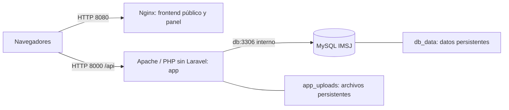

# Infraestructura y operación para la transición a PHP sin Laravel

**Proyecto:** Educación Vial IMSJ  
**Cambio:** CC-05, decisión del grupo del 02/10/2026.  
**Estado:** condiciones de adaptación documentadas; archivos de infraestructura y scripts aún utilizan Laravel.  
**Revisión interna:** Juan Robaina, pendiente. Crédito y responsabilidad documental del grupo.

> **Asistencia de IA identificada:** correspondencia entre infraestructura existente y API base; los pasos siguientes son trabajo pendiente, sin evidencia de reconstrucción o migración ejecutada.

## 1. Topología de destino

Se conserva Nginx para los dos frontends estáticos, Apache/PHP para la API y MySQL para datos. CC-05 sustituye la aplicación Laravel dentro de `app`. No cambia por sí solo las versiones PHP 8.5/MySQL 8.4, servicios, puertos locales 8000/8080 ni la administración posterior por la Intendencia.

Es un destino documentado, todavía no el resultado de `compose.yaml`. HTTPS, dominio y alojamiento real siguen por definir; no se añade un proveedor. MySQL permanece sin puerto publicado en la topología IMSJ, aunque el ejemplo publique 3308.

## 2. Archivos que requieren adaptación

| Archivo / parte actual | Cambio necesario para CC-05 | Verificación pendiente |
|---|---|---|
| `backend/Dockerfile` | Mantener PHP/Apache y extensiones requeridas; instalar dependencias finales desde su lock; retirar llamadas Artisan y permisos exclusivos del bootstrap Laravel. | Construcción limpia sin dependencias del framework; solo raíz pública accesible. |
| `backend/public/index.php` y reglas Apache | Entrada PHP/router para `/api`; preservar cabecera Authorization y publicación de archivos permitidos. | Health, rutas con parámetros/estado, PUT, OPTIONS y 404; `.env`, SQL, código y caché inaccesibles. |
| `backend/compose.yaml` | Adaptar configuración de la aplicación y persistencia, conservando base/frontends. | Dependencia de salud DB y montaje de archivos; arranque y recreación sin pérdida. |
| `backend/.env.example` | Describir variables que realmente lea el backend PHP; retirar claves exclusivas solo cuando se elimine su uso. | Entorno nuevo, instalación con configuración existente y producción sin secretos de demo. |
| `backend/composer.json` / `composer.lock` | Sustituir dependencias/scripts Laravel por el conjunto necesario de bibliotecas puntuales. | PHP compatible, instalación reproducible y ausencia de componentes Laravel/Sanctum/Eloquent. |
| `backend/iniciar.bat` | Sustituir generación de APP_KEY, migrate, seed y storage:link por preparación PHP/SQL revisada. | Primera instalación y arranques posteriores separados; no sobrescribir entorno ni volver a cargar datos existentes. |
| `backend/detener.bat` | Verificar parada del entorno adaptado. | Conserva los volúmenes y no introduce borrado de datos. |
| `database/` | Separar instalación vacía de actualización de una base con datos; preservar esquema IMSJ. | SQL revisado y restauración probada; sin importar `utu_demo` ni tablas de productos. |
| `storage/` / URLs públicas | Reemplazar dependencia del filesystem Laravel preservando rutas/volumen o transición aprobada. | Carga, lectura, edición y borrado de archivos sin perder enlaces existentes. |

El árbol de código de destino es una sugerencia documentada en [migración](../migracion_backend_vanilla.md). No se ofrecen comandos de un instalador PHP que todavía no existe.

## 3. Correspondencia de configuración

Los nombres del ejemplo no coinciden todos con IMSJ. Esta tabla es un mapa para preparar configuración, no una orden de renombrar el `.env` actual.

| Concepto | IMSJ actual | API base | Criterio para adaptar |
|---|---|---|---|
| Ambiente | `APP_ENV=local` / producción Laravel | `development` / `production` | Si se reutiliza su validador, traducir `local` a `development`; registrar el nombre final. |
| Servidor/puerto DB | `DB_HOST=db`, `DB_PORT=3306` | Servicio `database` en el Compose de ejemplo | Conservar servicio IMSJ `db`; no copiar host de ejemplo ni usar localhost dentro de app. |
| Base / usuario | `DB_DATABASE`, `DB_USERNAME` | `DB_NAME`, `DB_USER` | Resolver alias o renombre conjunto con Compose/configuración; conservar base/datos IMSJ. |
| Contraseña DB | `DB_PASSWORD`; `DB_ROOT_PASSWORD` para administración | `DB_PASSWORD`; `MYSQL_ROOT_PASSWORD` | Credenciales por instalación; no sustituir por contraseñas de demo. |
| Clave de aplicación | `APP_KEY` Laravel | `SECRET_KEY` para JWT | Son usos distintos. No reutilizar una como otra; SECRET_KEY solo corresponde si se adopta JWT y se define su gestión. |
| Duración de token | Ocho horas en AuthService | `TOKEN_LIFETIME=3600` | Mantener comportamiento actual salvo cambio aprobado; variable final por definir. |
| Origen frontend | Navegador en `http://localhost:8080` | `FRONTEND_ORIGIN=http://localhost:5173` | Autorizar el origen real, métodos/cabeceras Bearer y preflight; no copiar 5173. |
| API y puertos | `APP_URL`, `APP_PORT=8000`, `FRONTEND_PORT=8080` | `API_PORT=8002`, `MYSQL_PORT=3308` | Mantener URLs consumidas; los JS fijan 8000 y un cambio de entorno no los actualiza. |
| Almacenamiento | `app_uploads` sobre `storage/app/public` | `storage/cache` del limitador | Diferenciar contenidos persistentes de caché; permisos y montaje final por verificar. |

## 4. Procedimiento de transición que debe completar el equipo

1. Identificar instalación, versión actual, base/volúmenes y archivos; decidir y registrar el tratamiento de sesiones. Preparar copia de respaldo y comprobar su restauración en un entorno aislado.
2. Construir la versión PHP adaptada con su configuración y lock. Comprobar que el arranque no ejecuta Artisan y que falla de forma controlada si faltan variables necesarias.
3. En una **instalación nueva aislada**, preparar únicamente el esquema y datos iniciales IMSJ revisados. Registrar archivos y comandos realmente implementados antes de actualizar la guía de reconstrucción.
4. En una **instalación existente**, ejecutar solo las actualizaciones revisadas para esa versión. No usar un SQL con DROP como actualización ni borrar volúmenes para hacer funcionar la demo.
5. Comprobar API y ambos frontends; cuentas/roles, contenidos, archivos, historial y agenda académica. Ejecutar los escenarios [V-CC05](../verificacion.md) sobre MySQL.
6. Detener y recrear contenedores para comprobar persistencia; comprobar recuperación de base y archivos. Conservar evidencia de las operaciones realmente hechas.
7. Registrar versión, resultados, revisión y decisiones pendientes; preparar guía de operación final y reversión con código/configuración/datos compatibles. Aceptaciones del Inspector en actas del equipo.

No hay fecha nueva ni servidor institucional definido. El cambio académico de framework debe quedar registrado con docentes; no se fabrica esa conformidad.

## 5. Documentación vigente durante la transición

La [reconstrucción actual](reconstruccion-infraestructura.md) y el [inventario existente](documentacion-infraestructura.md) siguen describiendo los archivos Laravel presentes. Sus comandos Artisan solo sirven para esa versión. Cuando se implemente CC-05 se reemplazarán por comandos y evidencia del backend PHP, conservando identificación de la versión anterior donde sea necesaria para recuperación.

La [justificación tecnológica](justificacion-tecnologica.md) contiene el razonamiento anterior y la adenda de cambio. La API base y sus límites están en [análisis de referencia](../referencia_api_completa.md). Esta actualización no presenta Docker ni la migración de datos como ejecutados.
